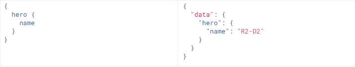
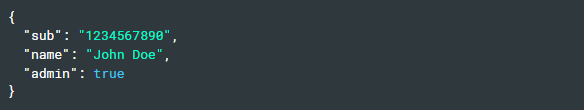

API - Application Programming Interface - Giao diện lập trình ứng dụng  
Cho phép hai thành phần phần mềm giao tiếp với nhau bằng cách sử dụng một tập hợp các định nghĩa - definitions và giao thức - protocols.  
Kiến trúc API thường được giải thích dưới dạng máy khách và máy chủ. Ứng dụng gửi yêu cầu được gọi là máy khách và ứng dụng gửi phản hồi được gọi là máy chủ.  

Các loại API:  
- SOAP API Sử dụng Simple Object Access Protocol - giao thức truy cập đối tượng cơ bản  
- RPC APIs - Remote Procedure Calls - cuộc gọi thủ tục từ xa: Khi client hoàn thành chức năng hoặc thủ tục trên server, server sẽ gửi kết quả đầu ra cho client  
- Websocket APIs Là một bước phát triển API web hiện đại khác sử dụng các đối tượng JSON để truyền dữ liệu. API WebSocket hỗ trợ giao tiếp hai chiều giữa ứng dụng khách và máy chủ. Máy chủ có thể gửi tin nhắn gọi lại tới các máy khách được kết nối, làm cho nó hiệu quả hơn API REST.  
- REST APIs - Representational State Transfer - Chuyển trạng thái đại diện.  
    Đây là những API linh hoạt và phổ biến nhất được tìm thấy trên web hiện nay.  
    Client gửi yêu cầu đến server dưới dạng dữ liệu. Server sử dụng dữ liệu đầu vào để khởi động các chức năng bên trong và trả dữ liệu đầu ra về Client.  
    Client server trao đổi dữ liệu bằng http qua tập hợp các phương thức GET,PUT,DELETE, POST,...  
    REST APIs là statelessness - không trạng thái - máy chủ không lưu dữ liệu máy khách giữa các yêu cầu.   
    - Lợi ích:  
    Integration - Tích hợp: API được sử dụng để tích hợp ứng dụng mới với hệ thống phần mềm hiện tại. Điều này làm tăng tốc độ phát triển vì không cần phải viết lại từng chức năng từ đầu. Bạn có thể sử dụng API để tận dụng mã hiện có.  
    Innovation - Sự đổi mới: Rất nhiều lĩnh vực có thể thay đổi khi một ứng dụng mới ra mắt. Doanh nghiệp cần khẩn trương phản ứng và hỗ trợ việc triển khai nhanh chóng các dịch vụ đổi mới. Họ có thể thực hiện việc này bằng cách thực hiện các thay đổi ở cấp độ API mà không cần phải viết lại toàn bộ mã. 
    Expansion - sự bành trướng: Cho phép sử dụng trên đa nền tẳng. Ví dụ: maps API cho phép tích hợp thông tin bản đồ qua trang web, Android, iOS, v.v.  
    Ease of maintenance: API hoạt động như một cổng kết nối giữa hai hệ thống. Mỗi hệ thống có nghĩa vụ thực hiện các thay đổi nội bộ để API không bị ảnh hưởng. Bằng cách này, mọi thay đổi mã trong tương lai của một bên không ảnh hưởng đến bên kia.  
Web API:  
    API Web hoặc Web Service API là giao diện xử lý ứng dụng giữa máy chủ web và trình duyệt web. Tất cả web services đều là API nhưng không phải tất cả các API đều là web services. API REST là một loại API Web đặc biệt.  
    - Các Anntation trong spring  
    @RestController :  Trả về dữ liệu dưới dạng JSON  
    @RestControllerAdvice : Tác động vào quá trình xử lý của các @RestController. Kết hợp với @ExceptionHandler xử lý các ngoại lệ xảy ra.  
    @ConfigurationProperties: cho phép cấu hình ứng dụng từ bên ngoài và lấy các thông tin đó ra một cách dễ dàng. Để khởi chạy sử dụng @EnableConfigurationProperties lên main App. Các parameter:
        - prefix = "loda": Chỉ lấy các config có tiền tố là "loda"
        - @PropertySource("classpath:loda.yml"): Đánh dấu để lấy config từ trong file loda.yml. Nếu không có annotation này, Spring sẽ sử dụng file mặc định 
(classpath:application.yml trong thư mục resources)   

        @RequestBody: Dùng trong API (@RestController), nhận các thông tin từ phía Client gửi lên Server dưới dạng JSON (tương tự @)ModelAttribute  
        vd:  
            @PostMapping("/todo")  
            public ResponseEntity addTodo(@RequestBody Todo todo){}  
        @PathVariable: Dùng trong API, tương tự @RequestParam lấy ra thông tin trong URL  
        vd:  
            @GetMapping("/todo/{todoId}")  
            public Todo getTodo(@PathVariable(name = "todoId") Integer todoId){}  
        @ExceptionHandler(IndexOutOfBoundsException.class) : Kết hợp với @RestControllerAdvice xử lý các ngoại lệ xảy ra.  
        Các parameter:  
            - Exception.class: Tất cả các Exception không được khai báo sẽ được xử lý tại đây
                IndexOutOfBoundsException.class: IndexOutOfBoundsException sẽ được xử lý riêng tại đây  
        @ResponseStatus(value = HttpStatus.BAD_REQUEST) : Xác định loại Http Status trả về cho người dùng sẽ được xử lý bởi mothod bên dưới.
        Các parameter:  
            - HttpStatus.INTERNAL_SERVER_ERROR: xử lý cho tất cả Exception
            - HttpStatus.BAD_REQUEST : xử lý cho BAD_REQUEST 

API integrations:   
    Là các thành phần phần mềm tự động cập nhật dữ liệu giữa máy khách và máy chủ.   
    VD:  khi dữ liệu tự động đồng bộ hóa với đám mây từ thư viện hình ảnh trên điện thoại của bạn hoặc ngày và giờ tự động đồng bộ hóa trên máy tính xách tay của bạn khi bạn di chuyển đến một múi giờ khác.  
API endpoint:  
    Là điểm tiếp xúc cuối cùng trong hệ thống giao tiếp của API. Những điểm cuối này bao gồm URL máy chủ, dịch vụ và những địa điểm kỹ thuật số cụ thể khác, từ đây thông tin được gửi đi và tiếp nhận giữa các hệ thống. Điểm cuối API rất quan trọng đối với doanh nghiệp vì 2 lý do chính:  
    Bảo mật : Điểm cuối API khiến hệ thống dễ bị tấn công. Việc giám sát API để ngăn tình trạng lạm dụng là rất quan trọng.  
    Hiệu năng : Điểm cuối API, nhất là những điểm cuối có lưu lượng truy cập cao, có thể gây ra tình trạng nghẽn mạng và ảnh hưởng đến hiệu năng hệ thống.

```
REST APIs - Representational State Transfer - Chuyển trạng thái đại diện
``` 
  
Là một kiểu kiến ​​trúc để cung cấp các tiêu chuẩn giữa các hệ thống máy tính trên web, giúp các hệ thống giao tiếp với nhau dễ dàng hơn.  
Các hệ thống tuân thủ REST, thường được gọi là hệ thống RESTful    
REST không trạng thái và tách biệt các mối quan tâm của máy khách và máy chủ.  
- Tách client - server  
Triển khai ứng dụng khách và triển khai máy chủ có thể được thực hiện độc lập mà không cần biết về nhau. Hay mã ở phía máy khách có thể được thay đổi bất cứ lúc nào mà không ảnh hưởng đến hoạt động của máy chủ và mã ở phía máy chủ có thể được thay đổi mà không ảnh hưởng đến hoạt động của máy khách.  
CLient - server chỉ cần quan tâm đến định dạng tin nhắn sẽ gửi cho bên kia.  
Sự tách biệt cho phép mỗi thành phần có khả năng phát triển độc lập.   
- Statelessness - không trạng thái  
Máy chủ không cần biết bất cứ điều gì về trạng thái của máy khách và ngược lại.  

Giao tiếp giữa Client và Server:  
- Về request  
REST yêu cầu máy khách đưa ra yêu cầu tới máy chủ để truy xuất hoặc sửa đổi dữ liệu trên máy chủ. Một yêu cầu thường bao gồm:   
-một động từ HTTP, xác định loại thao tác sẽ thực hiện  
-một tiêu đề , cho phép khách hàng chuyển thông tin về yêu cầu  
-đường dẫn đến tài nguyên  
-nội dung tùy chọn chứa dữ liệu  
Trong phần đầu của yêu cầu, máy khách sẽ gửi loại nội dung mà nó có thể nhận được từ máy chủ. Đây được gọi là Accept field và nó đảm bảo rằng máy chủ không gửi dữ liệu mà máy khách không thể hiểu hoặc xử lý được. Các tùy chọn cho loại nội dung là Loại MIME hoặc Tiện ích mở rộng thư Internet đa năng  
MIME bao gồm type và subtype, phân tách bằng dấu gạch chéo. VD text/html, text/css, text/plain,audio/wav,application/json,...  
Trong API RESTful, các đường dẫn phải được thiết kế để giúp khách hàng biết điều gì đang diễn ra.  
- Về responese  
Phải bao gồm một content-type trong tiêu đề của phản hồi. Trường này thông báo cho máy khách về loại dữ liệu mà nó đang gửi trong phần nội dung phản hồi -  là Loại MIME.  
Các mã trạng thái để thông báo cho khách hàng thông tin về sự thành công của hoạt động.  

|mã trạng thái|	Nghĩa|
|---|---|
|200 (được)| Đây là phản hồi tiêu chuẩn cho các yêu cầu HTTP thành công.|
|201 (ĐÃ TẠO)|Đây là phản hồi tiêu chuẩn cho một yêu cầu HTTP dẫn đến một mục được tạo thành công.|
|204 (KHÔNG CÓ NỘI DUNG)|Đây là phản hồi tiêu chuẩn cho các yêu cầu HTTP thành công, trong đó không có gì được trả về trong nội dung phản hồi.|
|400 (YÊU CẦU LỖI)|	Không thể xử lý yêu cầu do cú pháp yêu cầu sai, kích thước quá lớn hoặc lỗi máy khách khác.|
|403 (CẤM)|	Máy khách không có quyền truy cập tài nguyên này.|
|404 (KHÔNG TÌM THẤY)|	Không thể tìm thấy tài nguyên tại thời điểm này. Có thể nó đã bị xóa hoặc chưa tồn tại.|
|500 (LỖI MÁY CHỦ NỘI BỘ)|	Câu trả lời chung cho lỗi không mong muốn nếu không có thêm thông tin cụ thể.|  

```
API JSON -  JavaScript Object Notation API 
```
Là một sơ đồ mã hóa được thiết kế để loại bỏ nhu cầu về mã đặc biệt cho mỗi ứng dụng để giao tiếp với các máy chủ giao tiếp theo một cách xác định. Mô-đun API JSON hiển thị cách triển khai cho kho lưu trữ dữ liệu và cấu trúc dữ liệu, chẳng hạn như loại thực thể, gói và trường.  
JSON API được thiết kế để giảm thiểu cả số lượng yêu cầu và lường dữ liệu được truyền giữa client và server. Hiệu quả này đạt được mà không ảnh hường đến khả năng đọc và tính linh hoạt.  
```
GraphQL 
```
Là ngôn ngữ truy vấn cho API và server-side runtime để thực hiện truy vấn bằng type system mà bạn xác định cho dữ liệu của mình.  
GraphQL không bị ràng buộc với bất kỳ cơ sở dữ liệu hoặc công cụ lưu trữ cụ thể nào và thay vào đó được hỗ trợ bởi mã và dữ liệu hiện có của bạn.  
GrapQL được tạo bằng cách xác định các loại và trường trên các loại đó, sau đó cung cấp các chức năng cho từng trường trên từng loại.  
  
  
Truy vấn cần có cùng hình dạng với kết quả.  
  
  
truyền đối số 1 cách đơn giản, mọi field và object lồng nhau đều nhận được các đối số riêng lẻ. Khác với REST, truyền 1 tập đối số cho tất cả  
  
   
- Aliases: đặt bí danh cho 2 field muốn trả về mà cùng tên nếu muốn nhận được cả hai kết quả trong một yêu cầu.  
  
- Fragments : Tạo ra các đơn vị có thể tái sử dụng trong truy vấn - có thể dùng biến trong Fragment  
  
  
- Inline Fragments  
Điều khiển trả về, nếu hero có ep là JEDI, nếu là Droid => retrun primaryFunction; nếu là Human => return height  
  
- Variables  
  
Biến mặc định  
  
- Directives - chỉ thị  
@include(if: Boolean)Chỉ đưa trường này vào kết quả nếu đối số là true.  
@skip(if: Boolean)Bỏ qua trường này nếu đối số là true.  
  
- Mutations  
  
- meta  
Xác định xem sẽ nhận được loại nào từ GraphQL  
  


```
JWT - JSON Web Token
```
Là một tiêu chuẩn/phương pháp mở mã hóa dựa trên mã thông báo được sử dụng để truyền thông tin một cách an toàn dưới dạng đối tượng JSON.  
Máy khách và Máy chủ sử dụng JWT để chia sẻ thông tin một cách an toàn    
Là một tiêu chuẩn mở ( RFC 7519 ) xác định truyền thông tin một cách an toàn giữa các bên dưới dạng đối tượng JSON. Thông tin này có thể được xác minh và tin cậy vì nó được ký điện tử. JWT có thể được ký bằng bí mật (với thuật toán HMAC ) hoặc cặp khóa công khai/riêng tư bằng RSA hoặc ECDSA .  
Nên dùng JWT khi:  
- Ủy quyền : Đây là tình huống phổ biến nhất khi sử dụng JWT. Sau khi người dùng đăng nhập, mỗi yêu cầu tiếp theo sẽ bao gồm JWT, cho phép người dùng truy cập các tuyến đường, dịch vụ và tài nguyên được phép với mã thông báo đó. Đăng nhập một lần là một tính năng được JWT sử dụng rộng rãi hiện nay, vì chi phí nhỏ và khả năng dễ dàng sử dụng trên các miền khác nhau.
- Trao đổi thông tin : Mã thông báo web JSON là một cách tốt để truyền thông tin an toàn giữa các bên. Bởi vì JWT có thể được ký—ví dụ: sử dụng cặp khóa công khai/riêng tư—bạn có thể chắc chắn người gửi đúng như họ nói. Ngoài ra, vì chữ ký được tính bằng tiêu đề và tải trọng, bạn cũng có thể xác minh rằng nội dung không bị giả mạo.  

Cấu trúc gồm ba phần được phân tách bằng dấu chấm :  
- Header  
    Thường bao gồm hai phần: loại mã thông báo JWT và thuật toán ký đang được sử dụng  
      
    Sau đó, JSON này được mã hóa Base64Url để tạo thành phần đầu tiên của JWT.
- Payload  
    Chứa các claims - là các tuyên bố về thực thể và dữ liệu bổ sung  
    Có 3 loại claims:  
    - registered  
        Là một tập hợp các xác nhận quyền sở hữu được xác định trước, không bắt buộc nhưng được khuyến nghị:  iss (nhà phát hành), exp (thời gian hết hạn), sub (chủ đề), aud (đối tượng)  
    - public  
        Được xác định theo ý muốn của những người sử dụng JWT. Dể tránh xung đột => nên được xác định trong IANA JSON Web Token Registry or URI chứa không gian tên chống xung đột  
    - private  
        Là những xác nhận quyền sở hữu tùy chỉnh được tạo để chia sẻ thông tin giữa các bên đồng ý sử dụng chúng và không phải là xác nhận quyền sở hữu đã đăng ký hoặc công khai .  

      
    Sau đó, tải trọng được mã hóa Base64Url để tạo thành phần thứ hai của Mã thông báo web JSON.  
    Lưu ý:  đối với các mã thông báo đã ký, thông tin này, mặc dù được bảo vệ chống giả mạo, nhưng bất kỳ ai cũng có thể đọc được. Không đặt thông tin bí mật trong phần tử tải trọng hoặc tiêu đề của JWT trừ khi nó được mã hóa.
- Signature  
    Để tạo phần chữ ký, phải lấy tiêu đề được mã hóa, tải trọng được mã hóa, bí mật, thuật toán được chỉ định trong tiêu đề và ký tên đó.  
    VD chữ ký với thuật toán HMAC SHA256:   
    

Hoạt động:  
Khi người dùng đăng nhập thành công bằng thông tin đăng nhập của họ, JWT sẽ được trả về.  
Bất cứ khi nào người dùng muốn truy cập vào một tuyến đường hoặc tài nguyên được bảo vệ, tác nhân người dùng sẽ gửi JWT, thường là trong tiêu đề Ủy quyền bằng lược đồ Bearer   
  
Các tuyến được bảo vệ của máy chủ sẽ kiểm tra JWT hợp lệ trong Authorizationtiêu đề và nếu có, người dùng sẽ được phép truy cập các tài nguyên được bảo vệ.


