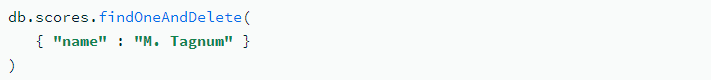
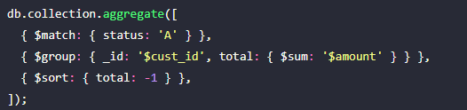
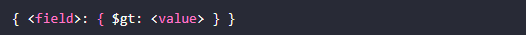
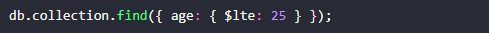
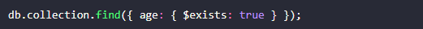
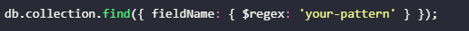
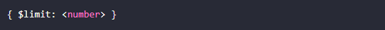
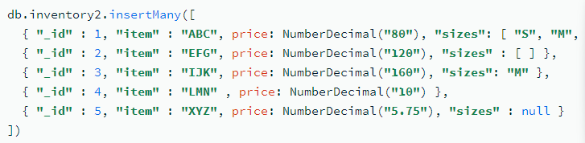

B. NoSQL - Not only SQL - Non SQL. Ở đây ta tập trung vào MongoDB
1. Các khái niệm cơ bản 
    ```
    Database trong NoSQL - MongoDB
    ```
    Cơ sở dữ liệu được sử dụng để lưu trữ và quản lý một tập hợp các colection. Nó bao gồm nhiều colection, chỉ mục và các cấu trúc dữ liệu thiết yếu khác cần thiết để lưu trữ dữ liệu một cách hiệu quả.
    ```
    NoSQL
    ```
    Là một loại cơ sở dữ liệu không quan hệ, không sử dụng mô hình quan hệ hay ngôn ngữ SQL để lưu trữ và truy xuất dữ liệu. 
    Là cơ sở dữ liệu không phải dạng bảng và lưu trữ dữ liệu khác với các bảng quan hệ.
    Các loại NoSQL: document, key-value, wide-column, and graph.
    NoSQL có sơ đồ linh hoạt, dễ mở rộng quy mô với lượng dữ liệu lớn và lượng người dùng cao và thường được sử dụng cho các ứng dụng web, di động, trò chơi hay các kho dữ liệu lớn.
    ```
    Collection
    ```
    Là một nhóm các Document. Tên của một Collection phải là duy nhất trong cơ sở dữ liệu của nó. Collections có thể được xem như các bảng tương đương trong cơ sở dữ liệu quan hệ.
    ```
    Document
    ```
    Là một bản ghi trong Collection. Nó bao gồm một tập hợp các trường, tương tự như một hàng trong cơ sở dữ liệu quan hệ. Tuy nhiên, không giống như các bảng trong cơ sở dữ liệu quan hệ, không có lược đồ hoặc cấu trúc cụ thể nào được thực thi trên các Document trong mộtCollection.
    ```
    Field
    ```
    Là cặp khóa-giá trị bên trong Document. Nó có thể lưu trữ nhiều loại dữ liệu, bao gồm chuỗi, số, mảng và các tài liệu khác. Các trường có thể được coi là các cột trong cơ sở dữ liệu quan hệ.
    ```
    Query
    ```
    Một Query được sử dụng để truy xuất dữ liệu từ cơ sở dữ liệu. Nó truy xuất các tài liệu cụ thể hoặc tập hợp con của các tài liệu từ một bộ sưu tập dựa trên một điều kiện nhất định.
    ```
    Index
    ```
    Chỉ mục là cấu trúc dữ liệu giúp cải thiện tốc độ của các thao tác tìm kiếm phổ biến. Chúng lưu trữ một phần nhỏ của tập dữ liệu trong một cấu trúc được tổ chức tốt. Cấu trúc này cho phép tìm kiếm và sắp xếp tài liệu nhanh hơn bằng cách giảm số lượng tài liệu mà nó phải quét.  
    Hoạt động tương tự như các chỉ mục được tìm thấy trong một cuốn sách, giúp nhanh chóng định vị thông tin cụ thể thay vì quét qua toàn bộ nội dung  
    Là cấu trúc dữ liệu chứa phiên bản nhỏ hơn của dữ liệu trong document, cùng với tham chiếu đến tài liệu gốc  
    Các loại của index  
    -Single Field Index: Chỉ mục dựa trên một trường duy nhất trong tài liệu.  
    -Multikey Index:  Chỉ mục được sử dụng khi trường được lập chỉ mục chứa một mảng giá trị.  
    -Text Index: Index dùng để hỗ trợ truy vấn tìm kiếm văn bản trên nội dung chuỗi.  
    -2dsphere Index: Chỉ mục được sử dụng để hỗ trợ các truy vấn không gian địa lý trên dữ liệu hình cầu.  
    -2d Index: Chỉ mục được sử dụng để hỗ trợ các truy vấn không gian địa lý trên dữ liệu phẳng.

    ```
    Cursor
    ``````
    Là con trỏ tới tập kết quả của một truy vấn. Nó cho phép các nhà phát triển xử lý các tài liệu riêng lẻ từ tập kết quả một cách hiệu quả.  
    Là một đối tượng cho phép lặp lại và truy xuất tài liệu từ kết quả truy vấn. Khi thực hiện một truy vấn để tìm nạp tài liệu từ cơ sở dữ liệu, MongoDB sẽ trả về một con trỏ tới tập kết quả, được gọi là con trỏ. Con trỏ tự động xử lý hàng loạt tài liệu kết quả, cung cấp một cách hiệu quả để xử lý lượng lớn dữ liệu.  
    Con trỏ đóng một vai trò quan trọng trong việc quản lý các hoạt động của cơ sở dữ liệu, đặc biệt khi làm việc với các tập dữ liệu lớn. Chúng có thể giúp cải thiện hiệu suất và giảm dung lượng bộ nhớ cho ứng dụng.  
    Khi bạn thực hiện một truy vấn, MongoDB sẽ ngầm tạo một con trỏ.  
    Các phương thức con trỏ:  
    -count() : Trả về tổng số tài liệu trong tập kết quả.  
    -limit(n): Giới hạn số lượng tài liệu được truy xuất tới n.  
    -skip(n): Bỏ qua n các tài liệu đầu tiên trong tập hợp kết quả.  
    -sort(field, order): Sắp xếp tài liệu dựa trên trường và thứ tự đã chỉ định (1 cho tăng dần, -1 cho giảm dần).  
    -project(field): Chỉ định các trường để bao gồm hoặc loại trừ khỏi tài liệu kết quả.
    ```
    Aggregation - tập hợp
    ```
    Tập hợp là quá trình tóm tắt và chuyển đổi dữ liệu được lưu trữ trong các Collection. Nó được sử dụng để chạy các hoạt động phân tích phức tạp trên tập dữ liệu hoặc tạo báo cáo tóm tắt.  
    MongoDB cung cấp một khung tổng hợp mạnh mẽ cho phép bạn chuyển đổi, thao tác và phân tích dữ liệu trong bộ sưu tập của mình. Với khung tổng hợp, có thể thực hiện các tác vụ phân tích dữ liệu phức tạp, chẳng hạn như lọc, nhóm và tính trung bình một cách hiệu quả và dễ dàng.
    ```
    Replica set - bộ bản sao
    ```
    Là một nhóm các phiên bản duy trì cùng một bộ dữ liệu. Nó cung cấp khả năng dự phòng, tính sẵn sàng cao và chuyển đổi dự phòng tự động trong trường hợp nút chính không thể truy cập được.
    ```
    Sharding
    ```
    Là một phương pháp phân phối dữ liệu trên nhiều máy. Nó được sử dụng để chia tỷ lệ cơ sở dữ liệu theo chiều ngang bằng cách phân vùng tập dữ liệu thành các phần nhỏ hơn, dễ quản lý hơn được gọi là phân đoạn
    ```
    Key-value pair 
    ```
    Một kiểu cơ sở dữ liệu NoSQL lưu trữ dữ liệu dưới dạng các cặp khóa-giá trị. Khóa là duy nhất và được sử dụng để xác định và truy xuất giá trị. Giá trị có thể là bất kỳ loại dữ liệu nào, từ chuỗi, số, đối tượng, mảng hay tệp nhị phân.
    ```
    Column-based
    ```
    Một kiểu cơ sở dữ liệu NoSQL lưu trữ dữ liệu theo cách tổ chức thành các cột thay vì các hàng. Mỗi cột có thể có số lượng và kiểu thuộc tính khác nhau. Các cột được nhóm lại thành các bảng gọi là column families.
    ```
    Document-oriented
    ``` 
    Một kiểu cơ sở dữ liệu NoSQL lưu trữ dữ liệu dưới dạng các tài liệu, thường là định dạng JSON hay XML. Mỗi tài liệu có thể có các thuộc tính khác nhau và có thể được lập chỉ mục theo các thuộc tính này. Các tài liệu được nhóm lại thành các bộ sưu tập gọi là collections.
    ```
    Graph-based
    ```
    Một kiểu cơ sở dữ liệu NoSQL lưu trữ dữ liệu dưới dạng các đỉnh (nodes) và các cạnh (edges) củamột đồ thị. Mỗi đỉnh biểu diễn một thực thể và có thể có các thuộc tính khác nhau. Mỗi cạnh biểu diễn một quan hệ giữa hai đỉnh và có thể có hướng, trọng số hay nhãn
    ```
    Cluster  
    ```
    Nơi lưu trữ cơ sở dữ liệu
    ```
    Indexing - Lập chỉ mục 
    ```
    Rất quan trọng để tối ưu hóa hiệu suất cơ sở dữ liệu.  
    MongoDB hỗ trợ nhiều loại chỉ mục khác nhau, bao gồm chỉ mục trường đơn, chỉ mục phức hợp và chỉ mục văn bản.  
    Lập chỉ mục thích hợp có thể cải thiện đáng kể hiệu suất truy vấn bằng cách giảm khối lượng công việc mà cơ sở dữ liệu phải thực hiện để tìm dữ liệu liên quan.
    ```
    BSON và JSON
    ```
    + BSON là 1 binary-encoded serialization của các tài liệu giống như JSON. Nó được thiết kế để hoạt động hiệu quả trong lưu trữ, khả năng duyệt và mã hóa/giải mã. Một số tính năng chính của nó bao gồm:  
    -Mã hóa nhị phân : BSON mã hóa dữ liệu ở định dạng nhị phân, mang lại hiệu suất tốt hơn và cho phép lưu trữ các loại dữ liệu không được JSON hỗ trợ.  
    -Hỗ trợ các loại dữ liệu bổ sung : BSON hỗ trợ nhiều loại dữ liệu hơn so với JSON, chẳng hạn như Date, Binary, ObjectId và Decimal128. Điều này cho phép thể hiện dữ liệu đa dạng chính xác hơn.
    -Khả năng truyền tải hiệu quả : Trong BSON, kích thước của từng phần tử được mã hóa, giúp dễ dàng bỏ qua các phần tử, do đó làm cho quá trình truyền tải nhanh hơn.   
    + JSON là một định dạng biểu diễn dữ liệu nhẹ mà con người có thể đọc được, có thể dễ dàng phân tích cú pháp và tạo bằng nhiều ngôn ngữ lập trình. Nó được sử dụng rộng rãi như một phương tiện để truyền dữ liệu qua web. Một số tính năng của JSON bao gồm:  
    -Con người có thể đọc được : JSON ở dạng văn bản với cấu trúc đơn giản, giúp con người dễ dàng đọc và viết.  
    -Có thể tương tác : JSON có thể dễ dàng được phân tích cú pháp và tạo bởi nhiều ngôn ngữ lập trình khác nhau, khiến nó trở thành lựa chọn phổ biến để trao đổi dữ liệu giữa các ứng dụng.  
    -Các loại dữ liệu hạn chế : JSON hỗ trợ ít loại dữ liệu hơn so với BSON, chẳng hạn như chuỗi, số, boolean và null. Điều này có nghĩa là một số dữ liệu, chẳng hạn như ngày tháng hoặc dữ liệu nhị phân, phải được biểu diễn dưới dạng chuỗi hoặc đối tượng tùy chỉnh trong JSON.  
    + Trong MongoDB:  
    -BSON là định dạng nhị phân được sử dụng để lưu trữ và truy xuất dữ liệu hiệu quả với sự hỗ trợ cho các loại dữ liệu gốc bổ sung.  
    -JSON, là một định dạng dễ đọc hơn và được sử dụng rộng rãi hơn, thường được sử dụng để trao đổi dữ liệu giữa MongoDB và các ứng dụng.  
    Bằng cách sử dụng BSON trong nội bộ, MongoDB có thể tận dụng các lợi ích của nó trong lưu trữ, khả năng duyệt qua và biểu diễn kiểu dữ liệu phong phú hơn trong khi vẫn cung cấp khả năng tương tác và khả năng đọc của JSON thông qua các trình điều khiển và giao diện truy vấn.  

    ```
    Embedded Documents Arrays - Mảng tài liệu nhúng
    ```
    Là các mảng tài liệu phụ (còn được gọi là tài liệu lồng nhau) có thể được lưu trữ trong một document. Điều này cho phép lập mô hình các mối quan hệ dữ liệu phức tạp theo cách hiệu quả cao trong khi vẫn duy trì hiệu suất tốt.  
    Được sử dụng khi cần biểu thị mối quan hệ 1-n hoặc theo thứ bậc giữa dữ liệu. Thay vì sử dụng collection và tham chiếu riêng biệt => nhúng trực tiếp các tài liệu liên quan vào tài liệu chính bằng cách sử dụng một mảng.  

    <p align="center" width="100%"></p>  

    Ưu điểm của Embedded Documents Arrays:  
    -Hiệu suất Đọc/Ghi : Do dữ liệu liên quan được lưu trữ cùng nhau trong cùng một tài liệu nên các thao tác đọc và ghi có thể nhanh hơn vì chúng không yêu cầu nhiều truy vấn hoặc cập nhật.  
    -Tính nhất quán của dữ liệu : Bằng cách lưu trữ dữ liệu liên quan cùng nhau, bạn có thể dễ dàng duy trì tính nhất quán và đảm bảo rằng dữ liệu liên quan luôn đồng bộ mà không cần phải dựa vào liên kết hoặc tham chiếu chéo.  
    -Khả năng mở rộng : Các mảng nhúng có thể được lồng vào nhau, cho phép bạn biểu diễn các cấu trúc dữ liệu phức tạp trong khi vẫn duy trì các lợi ích của lược đồ linh hoạt và hiệu suất cao.  
    Nên sử dụng khi:  
    -Quan hệ 1 - n  
    -Dữ liệu nhúng không phát triển không giới hạn  
    -Dữ liệu được nhúng có liên quan chặt chẽ đến tài liệu gốc  
    -Muốn cải thiện hiệu suất đọc/ghi 

    ```
    Read/Write Concerns
    ```  
    Là các khía cạnh quan trọng của tính nhất quán và độ tin cậy của dữ liệu trong MongoDB  
    Xác định mức độ xác nhận mà cơ sở dữ liệu yêu cầu cho các thao tác đọc và ghi.  
    + Read Concerns  
    Xác định mức độ nhất quán của dữ liệu được truy vấn trả về.  
    chỉ định phiên bản dữ liệu mà truy vấn sẽ trả về  
    Các mức độ trong read concerns:  
    -local - mặc định: Trả về dữ liệu gần đây nhất có sẵn trên nút chính tại thời điểm thực hiện truy vấn. Nó không đảm bảo tính nhất quán giữa các replica sets - bộ bản sao.  
    -available: Truy vấn trả về dữ liệu gần đây nhất có sẵn trên nút được truy vấn. Mức này chỉ áp dụng cho các sharded clusters - cụm phân mảnh.  
    -majority:  Truy vấn trả về dữ liệu đã được đa số thành viên bộ bản sao thừa nhận. Nó cung cấp mức độ nhất quán cao hơn nhưng có thể có độ trễ cao hơn.  
    -linearizable: Đảm bảo đọc dữ liệu gần đây nhất đã được phần lớn các bộ bản sao thừa nhận. Cấp độ này đảm bảo tính nhất quán cao nhất nhưng có thể chậm nhất trong tất cả các cấp độ.  
    -snapshot: Trả về dữ liệu từ dấu thời gian ảnh chụp nhanh cụ thể. Mức này hữu ích cho các giao dịch đã đọc với cách ly ảnh chụp nhanh.  
    + Write Concern  
    Cho biết mức độ xác nhận mà MongoDB sẽ cung cấp khi ghi dữ liệu vào cơ sở dữ liệu. Nó đảm bảo rằng dữ liệu đã được ghi và sao chép thành công trước khi xác nhận thao tác ghi. Các mức Write Concern khác nhau là:  
    -w: 0 Thao tác ghi không được xác nhận, có nghĩa là MongoDB không gửi bất kỳ xác nhận nào. Mức này cung cấp độ trễ thấp nhất nhưng có nguy cơ mất dữ liệu.  
    -w: 1 - mặc định: Thao tác ghi được xác nhận sau khi được ghi thành công vào nút chính. Nó không đảm bảo sao chép sang các thành viên bộ bản sao khác.
    -w: majority : Thao tác ghi được thừa nhận sau khi được ghi và sao chép tới phần lớn các thành viên của bộ bản sao. Mức này cung cấp độ bền dữ liệu tốt hơn nhưng có thể tăng độ trễ.  
    -w: number : Thao tác ghi được xác nhận sau khi được sao chép tới số lượng thành viên bộ bản sao đã chỉ định. Mức này cung cấp một mức tùy chỉnh về độ bền của dữ liệu.  
    Ngoài ra, các tùy chọn j và wtimeout có thể được sử dụng để tinh chỉnh Write Concern  
    -j: true/false : Chỉ định liệu thao tác ghi có phải được ghi vào nhật ký trước khi xác nhận hay không. Cài đặt j: true đảm bảo dữ liệu được cam kết vào nhật ký và giúp tăng độ bền.  
    -wtimeout: ms : Chỉ định giới hạn thời gian tính bằng mili giây để xác nhận thao tác ghi. Nếu không nhận được xác nhận trong thời gian đã chỉ định, thao tác sẽ trả về lỗi hết thời gian chờ. Tuy nhiên, điều này không có nghĩa là thao tác ghi không thành công; nó vẫn có thể thành công vào thời điểm sau này.
2. Tính năng của NoSQL
    ```
    Flexible Schema - linh hoạt trong lược đồ: 
    ```
    Không giống như SQL, phải xác định và khai báo lược đồ của bảng trước khi chèn dữ liệu Collections của NoSQL không yêu cầu các document của chúng phải có cùng một lược đồ. Có nghĩa là:
    - Các document trong một collection không cần phải có cùng một tập hợp các trường và kiểu dữ liệu - có thể khác nhau giữa các document trong một collection.
    - Để thay đổi cấu trúc document trong một collection, chẳng hạn như thêm, sửa, xóa trường hiện có hoặc thay đổi giá trị thành loại mới => cập nhật document sang cấu trúc mới.
    Tính linh hoạt này tạo điều kiện thuận lợi cho việc ánh xạ document tới một thực thể hoặc một đối tượng. Mỗi document có thể khớp với các trường dữ liệu của thực thể được đại diện, ngay cả khi document đó có sự thay đổi đáng kể so với các document khác trong collection.
    Tuy nhiên, trên thực tế, các document trong một collection có chung cấu trúc và có thể thực thi các quy tắc xác thực document cho một bộ sưu tập trong quá trình cập nhật và chèn các thao tác.

    ```
    Horizontal Scaling - chia tỉ lệ ngang:
    ``` 
    -Hầu hết các cơ sở dữ liệu SQL đều yêu cầu mở rộng quy mô theo chiều dọc (di chuyển sang máy chủ lớn hơn, đắt tiền hơn) khi vượt quá yêu cầu về dung lượng của máy chủ hiện tại.còn NoSQL cho phép mở rộng quy mô theo chiều ngang, nghĩa là có thể thêm các máy chủ rẻ hơn bất cứ khi nào cần.
    Horizontal Scaling còn được gọi là mở rộng tỷ lệ, đề cập đến việc đưa vào các nút bổ sung để chia sẻ tải. Điều này rất khó với cơ sở dữ liệu quan hệ do khó phân tán dữ liệu liên quan giữa các nút. Với cơ sở dữ liệu không quan hệ, điều này được thực hiện đơn giản hơn vì các bộ sưu tập là độc lập và không được ghép nối theo quan hệ. Điều này cho phép chúng được phân phối trên các nút đơn giản hơn, vì các truy vấn không phải “nối” chúng lại với nhau trên các nút.  
    -MongoDB sử dụng sharding(ưu tiên) và Replica Sets - bộ bản sao để chia tỉ lệ  
    -Sharding: phân chia bằng cách trải rộng dữ liệu trên nhiều node, mỗi node chứa tập hợp dữ liệu con của tổng thể => hiệu quả trong tăng thông lượng thao tác ghi( do mỗi thao tác chỉ ảnh hưởng đến một trong các node và phân vùng dữ liệu mà nó đang quản lý). Theo thời gian, các tập dữ liệu thường không phát triển đồng đều và các phân đoạn khác nhau sẽ phát triển với tốc độ nhanh hơn các phân đoạn khác. Khi khối lượng công việc của bạn phát triển và tập dữ liệu tăng lên, sẽ cần phải cân bằng lại dữ liệu để đảm bảo phân bổ tải đồng đều trên toàn cụm. Việc phân phối dữ liệu không đồng đều này được giải quyết thông qua cân bằng phân đoạn.  
    -Replica Sets: Tương tự như sharding, nhưng chúng khác ở chỗ tập dữ liệu được sao chép. Sao chép cho phép tính sẵn sàng cao, xử lý dự phòng/chuyển đổi dự phòng và giảm tắc nghẽn trong các hoạt động đọc. Tuy nhiên, chúng cũng có thể gây ra sự cố cho các ứng dụng có số lượng giao dịch ghi lớn, vì mỗi bản cập nhật phải được truyền tới mọi thành viên của bộ bản sao.  
    ```
    Truy vấn nhanh do mô hình dữ liệu: 
    ```
    Do dữ liệu trong cơ sở dữ liệu SQL thường được chuẩn hóa, do đó, các truy vấn cho một đối tượng hoặc thực thể đơn lẻ yêu cầu nối dữ liệu từ nhiều bảng. Khi các bảng của bạn tăng kích thước, các phép nối có thể trở nên đắt đỏ. 
    Tuy nhiên, dữ liệu trong cơ sở dữ liệu NoSQL thường được lưu trữ theo cách được tối ưu hóa cho các truy vấn. Nguyên tắc chung khi sử dụng MongoDB là dữ liệu được truy cập cùng nhau sẽ được lưu trữ cùng nhau. Các truy vấn thường không yêu cầu tham gia, vì vậy các truy vấn rất nhanh.
    ```
    Dễ sử dụng cho các nhà phát triển:
    ```
    Một số cơ sở dữ liệu NoSQL như MongoDB ánh xạ cấu trúc dữ liệu của chúng sang cấu trúc dữ liệu của các ngôn ngữ lập trình phổ biến. 
    Ánh xạ này cho phép các nhà phát triển lưu trữ dữ liệu của họ giống như cách họ sử dụng dữ liệu đó trong mã ứng dụng. Mặc dù có vẻ như là một lợi thế tầm thường, nhưng việc ánh xạ này có thể cho phép các nhà phát triển viết ít mã hơn, dẫn đến thời gian phát triển nhanh hơn và ít lỗi hơn.
3. Tại sao cần sử dụng NoSQL  
    ```
    Sử dụng NoSQL khi muốn lưu trữ và truy xuất một lượng dữ liệu khổng lồ, có cấu trúc không rõ ràng hoặc thay đổi theo thời gian, không quan tâm nhiều đến mối quan hệ giữa dữ liệu, và cần một cơ sở dữ liệu linh hoạt, có khả năng mở rộng và hiệu năng cao. 
    NoSQL mang đến:
    - Flexible schema - Lược đồ linh hoạt: Dễ dàng thích ứng với các thay đổi mà không làm gián đoạn ứng dụng.
    - Scalability - khả năng mở rộng: Chia tỷ lệ theo chiều ngang bằng cách phân vùng dữ liệu trên nhiều máy chủ (sharding).
    - Nhanh: Được thiết kế để đọc và ghi nhanh hơn, thường có ngôn ngữ truy vấn đơn giản hơn.
    - Xử lý khối lượng lớn dữ liệu: Phù hợp hơn để quản lý dữ liệu lớn và các ứng dụng thời gian thực.
    1 số yếu tố để lựa chọn NoSQL:
    - Phát triển Agile nhịp độ nhanh        
    - Lưu trữ dữ liệu có cấu trúc và bán cấu trúc
    - Khối lượng dữ liệu khổng lồ
    - Yêu cầu đối với kiến ​​trúc mở rộng quy mô
    - Các mô hình ứng dụng hiện đại như microservice và real-time streaming
    Hỗ trợ cho các cấu trúc dữ liệu khác nhau: Các cơ sở dữ liệu NoSQL khác nhau đáp ứng các nhu cầu khác nhau, như lưu trữ tài liệu, biểu đồ hoặc khóa-giá trị.
    Một số lĩnh vực ứng dụng của NoSQL là:
    - Big Users: Các ứng dụng web hay di động có số lượng người dùng lớn và đa dạng, cần phải xử lý nhiều yêu cầu và dữ liệu khác nhau.
    - The Internet of Things: Các thiết bị kết nối internet có khả năng tạo ra dữ liệu nhỏ, bán cấu trúc hoặc không cấu trúc, và được cập nhật liên tục.
    - Big Data: Các ứng dụng phân tích hay xử lý dữ liệu lớn, đặc biệt là dữ liệu không cấu trúc hay bán cấu trúc.
    - Dữ liệu quan trọng: Các ứng dụng lưu trữ dữ liệu tài chính, hồ sơ chăm sóc sức khỏe, hay các loại dữ liệu nhạy cảm khác.
4. Hạn chế NoSQL   
    Không hỗ trợ các giao dịch ACID(atomicity - tính nguyên tử, consistency - tính nhất quán, isolation - sự cô lập, durability - độ bền) trên nhiều document  
    Vì các mô hình dữ liệu trong cơ sở dữ liệu NoSQL thường được tối ưu hóa cho các truy vấn chứ không phải để giảm trùng lặp dữ liệu, nên cơ sở dữ liệu NoSQL có thể lớn hơn cơ sở dữ liệu SQL. Dung lượng lưu trữ hiện rẻ đến mức hầu hết coi đây là một nhược điểm nhỏ và một số cơ sở dữ liệu NoSQL cũng hỗ trợ nén để giảm dung lượng lưu trữ.  
5. Khác nhau giữa SQL và NoSQL

    |      Các tiêu chí     |                SQL database                         |                   NoSQL database                    |
    |-----------------------|-----------------------------------------------------|-----------------------------------------------------|
    |Mô hình lưu trữ dữ liệu| Table có column và row cố định| Lưu trữ dưới dạng Document, Key-value, column, Graph. Tables có rows và columns động|
    |Ngôn ngữ truy vấn| Có cấu trúc | Không có cấu trúc|
    |Lược đồ| Yêu cầu lược đồ xác định trước cho dữ liệu | Lược đồ động cho dữ liệu phi cấu trúc hoặc bán cấu trúc|
    |Mở rộng quy mô| theo chiều dọc - tăng lưu lượng phần cứng cho máy chủ duy nhất | theo chiều ngang - tăng số lượng máy chủ trong cụm |
    | Giao dịch ACID trên nhiều bản ghi| được hỗ trợ | Hầu hết không được hỗ trợ trên nhiều bản ghi|
    | Phù hợp | phù hợp cho môi trường truy vấn phức tạp | phù hợp cho các ứng dụng web thời gian thực hoặc xử lý dữ liệu lớn|
    | Ánh xạ dữ liệu đối tượng| Yêu cầu ORM - ánh xạ quan hệ đối tượng | Hầu như không yêu cầu ORM. MongoDB ánh xạ trực tiếp tới các cấu trúc dữ liệu trong hầu hết các ngôn ngữ lập trình phổ biến.|
6. Kiểu dữ liệu
    ```
    String:
    Sử dụng để lưu trữ dữ liệu văn bản. Nó phải là một chuỗi được mã hóa UTF-8 hợp lệ.
    ```

    <p align="center" width="100%"></p>

    ```
    Boolean:
    Sử dụng để lưu trữ các giá trị true hoặc false.
    ```

    <p align="center" width="100%"></p>

    ```
    Integer:
    Sử dụng để lưu trữ một giá trị số nguyên 32-bit ( int) và 64-bit ( long)
    ```

    <p align="center" width="100%"></p>

    ```
    Double:
    Sử dụng để lưu trữ các số dấu phẩy động 64 bit
    ```

    <p align="center" width="100%"></p>

    ```
    Date:
    Sử dụng để lưu trữ ngày và giờ ở định dạng thời gian Unix (dấu thời gian mili giây kể từ ngày 1 tháng 1 năm 1970, 00:00:00 UTC).
    ```

    <p align="center" width="100%"></p>

    ```
    Array:
    Được sử dụng để lưu trữ danh sách các giá trị trong một trường. Các giá trị có thể thuộc các kiểu dữ liệu khác nhau.
    ```

    <p align="center" width="100%"></p>

    ```
    Object:
    Được sử dụng để lưu trữ các tài liệu nhúng, nghĩa là một tài liệu có thể chứa một tài liệu khác.
    ```

    <p align="center" width="100%"></p>

    ```
    Null:
    Được sử dụng để lưu trữ một giá trị null
    ```
    <p align="center" width="100%"></p>

    ```
    Binary Data:
    Được sử dụng để lưu trữ dữ liệu nhị phân hoặc mảng byte
    ```
    
    <p align="center" width="100%"></p>

    ```
    Code:
    Được sử dụng để lưu trữ mã JavaScript.
    ```
    <p align="center" width="100%"></p>

    ```
    Regular Expression:
    Được sử dụng để lưu trữ các biểu thức chính quy.
    ```

    <p align="center" width="100%"></p>
    
    ```
    ObjectId:
    Là mã định danh 12 byte được sử dụng làm mã định danh duy nhất cho tài liệu trong bộ sưu tập. Đó là giá trị mặc định được tạo cho _idtrường, đảm bảo tính duy nhất trong bộ sưu tập.
    ```
    
    <p align="center" width="100%"></p>
7. Các câu lệnh và phương thức
    ```
    Create collection
    ```
    Tạo ngầm định : 
    <p align="center" width="100%"></p>
    Tạo rõ ràng : 
    <p align="center" width="100%"></p>

    ```
    Drop collection
    ```
    Xóa collection hoặc view khỏi cơ sở dữ liệu. Phương pháp này cũng loại bỏ bất kỳ chỉ mục nào được liên kết với collection bị xóa.  
    Cú pháp:  
      
    Các tham số:  
    | Field  | Description | 
    |---|---|
    | writeConcern | Không bắt buộc. Chỉ định mức xác nhận được yêu cầu từ MongoDB. |  

    Trả về:  
    -True khi loại bỏ thành công một collection.  
    -False khi collection muốn loại bỏ không tồn tại.  
    VD:  
      

    ```
    Insert document
    ```
    Dùng để thêm dữ liệu vào các collection  
    - insertOne  
    Dùng để chèn một tài liệu vào một collection  
    Trả về một document chứa:  
    -1 acknowledged - giá trị logic true nếu run với writeConcern, false nếu writeConcern bị vô hiệu hóa  
    -1 trường insertId có giá trị _id của document được chèn.  
    Cú pháp:  
     
    Các tham số:  
        |       Parameter         |       Type      |         decription                   |
        |-------------------------|-----------------|--------------------------------------|
        | document | document | 1 document được chèn vào collection|
        | writeConcern | document | Không bắt buộc. Chỉ định mức xác nhận được yêu cầu từ MongoDB cho thao tác ghi. Trong transaction không đặt rõ ràng writeConcern cho hoạt động|  

        Hành vi:  
        Nếu collection không tồn tại, method sẽ create luôn 1 collection  
        Nếu _id field không được chỉ định, MongoDB sẽ tự động chèn id; nếu có _id field, yêu cầu _id là duy nhất  
    VD:
    

    - Insert Many  
    Dùng để chèn nhiều tài liệu vào một collection  
    Trả về một document chứa:  
    -1 acknowledged - giá trị logic true nếu run với writeConcern, false nếu writeConcern bị vô hiệu hóa  
    -1 mảng insertedIds chứa các giá trị _id của document đã được chèn trong method.  
    Cú pháp:  
      
    Các tham số:  
        Parameter         |       Type      |         decription                   |
        |-------------------------|-----------------|--------------------------------------|
        | document | document | 1 mảng document được chèn vào collection|
        | writeConcern | document | Không bắt buộc. Chỉ định mức xác nhận được yêu cầu từ MongoDB cho thao tác ghi. Trong transaction không đặt rõ ràng writeConcern cho hoạt động|  
        | ordered | boolean | Không bắt buộc. Chỉ định xem phiên bản mongod sẽ thực hiện thao tác chèn có thứ tự hay không có thứ tự. Mặc định là true - theo thứ tự. | 

        Hành vi:  
        Chèn từng document trong mảng vào Collection.  
        Nếu collection không tồn tại, method sẽ create luôn 1 collection  
        Nếu _id field không được chỉ định, MongoDB sẽ tự động chèn id; nếu có _id field, yêu cầu _id là duy nhất  
    VD:
    

    ```
    Update document
    ```
    - Update one:  
    Update 1 single document dựa trên filter  
    Trả về một document chứa:  
    -matchedCount chứa số lượng tài liệu phù hợp.  
    -modifiedCount chứa số lượng tài liệu đã sửa đổi.  
    -upsertedId chứa _id cho tài liệu đã upserted.
    -boolean acknowledged giá trị logic true nếu run với writeConcern, false nếu writeConcern bị vô hiệu hóa   
    Cú pháp:  
      
    Các tham số:  
        Parameter         |       Type      |         decription                   |
        |-------------------------|-----------------|--------------------------------------|
        | filter | document | Chỉ định các tiêu chí để chọn tài liệu để cập nhật. Chỉ định một tài liệu trống { } để cập nhật tài liệu đầu tiên được trả về trong bộ sưu tập. |
        | update | document or pipeline | Các sửa đổi áp dụng cho tài liệu đã chọn. Có thể update bằng tài liệu thay thế db.collection.replaceOne(). |
        | upsert | boolean | Không bắt buộc.<br /> True : tạo 1 new document nếu không có document nào phù hợp bộ lọc hoặc Cập nhật một tài liệu nếu phù hợp với bộ lọc.<br /> False - mặc định: Chỉ update, không tạo new document  | 
        | writeConcern | document | Không bắt buộc. Chỉ định mức xác nhận được yêu cầu từ MongoDB cho thao tác ghi. Trong transaction không đặt rõ ràng writeConcern cho hoạt động|     
        | collation | document | Không bắt buộc. cho phép người dùng chỉ định các quy tắc dành riêng cho ngôn ngữ để so sánh chuỗi, chẳng hạn như quy tắc cho chữ cái và dấu trọng âm. Cú pháp:<br/>  |
        | arrayFilters | array | Không bắt buộc. Xác định phần tử mảng nào cần sửa đổi cho thao tác cập nhật trên trường mảng. | 
        | hint | Document or string | Không bắt buộc. Chỉ định chỉ mục sẽ sử dụng để hỗ trợ |
    
        Hành vi:   
        Tìm tài liệu đầu tiên matches với filter và áp dụng update
        Nếu thao tác cập nhật làm thay đổi document size, thao tác đó sẽ không thành công  
        VD:
          

    - Update Many  
    Cập nhật tất cả các document phù hợp với bộ lọc được chỉ định cho một collection.  
    Trả về một document chứa:  
    -matchedCount chứa số lượng tài liệu phù hợp.  
    -modifiedCount chứa số lượng tài liệu đã sửa đổi.  
    -upsertedId chứa _id cho tài liệu đã upserted.
    -boolean acknowledged giá trị logic true nếu run với writeConcern, false nếu writeConcern bị vô hiệu hóa   
    Cú pháp:  
      
    Các tham số:  
        Parameter         |       Type      |         decription                   |
        |-------------------------|-----------------|--------------------------------------|
        | filter | document | Chỉ định các tiêu chí để chọn tài liệu để cập nhật. Chỉ định một tài liệu trống { } để cập nhật tất cả tài liệu trong collection. |
        | update | document or pipeline | Các sửa đổi áp dụng cho tài liệu đã chọn. Có thể update bằng tài liệu thay thế db.collection.replaceOne(). |
        | upsert | boolean | Không bắt buộc.<br /> True : tạo 1 new document nếu không có document nào phù hợp bộ lọc hoặc Cập nhật một tài liệu nếu phù hợp với bộ lọc.<br /> False - mặc định: Chỉ update, không tạo new document  | 
        | writeConcern | document | Không bắt buộc. Chỉ định mức xác nhận được yêu cầu từ MongoDB cho thao tác ghi. Trong transaction không đặt rõ ràng writeConcern cho hoạt động|     
        | collation | document | Không bắt buộc. cho phép người dùng chỉ định các quy tắc dành riêng cho ngôn ngữ để so sánh chuỗi, chẳng hạn như quy tắc cho chữ cái và dấu trọng âm. Cú pháp:<br/>  |
        | arrayFilters | array | Không bắt buộc. Xác định phần tử mảng nào cần sửa đổi cho thao tác cập nhật trên trường mảng. | 
        | hint | Document or string | Không bắt buộc. Chỉ định chỉ mục sẽ sử dụng để hỗ trợ |
    
        Hành vi:   
        Update tất cả document matches với filter và áp dụng update
        Nếu thao tác cập nhật làm thay đổi document size, thao tác đó sẽ không thành công  
        VD:
        
        
    - Replace One  
    Thay thế một tài liệu phù hợp với tiêu chí truy vấn bằng một tài liệu mới.   
    Cú pháp:
      
    Các tham số chính:  
        Parameter         |       Type      |         decription                   |
        |-------------------------|-----------------|--------------------------------------|
        | filter | document | Chỉ định các tiêu chí để chọn tài liệu để cập nhật. Chỉ định một tài liệu trống { } để thay thế  tài liệu đầu tiên khớp trong collection. |
        | replacement | document | Tài liệu thay thế |  

        Trả về một document chứa:  
        -matchedCount chứa số lượng tài liệu phù hợp.  
        -modifiedCount chứa số lượng tài liệu đã sửa đổi.  
        -upsertedId chứa _id cho tài liệu đã upserted.
        -boolean acknowledged giá trị logic true nếu run với writeConcern, false nếu writeConcern bị vô hiệu hóa  
        Hành vi:  
        Thay thế tài liệu phù hợp đầu tiên trong bộ sưu tập phù hợp với bộ lọc, sử dụng replacement document.  
        Nếu thao tác cập nhật làm thay đổi document size, thao tác đó sẽ không thành công  
        VD:  
          

    ```
    Delete Document
    ```
    - Delete One  
    Xóa 1 document khỏi collection  
    Cú pháp:   
      
    Trả về document chứa:  
    -Một acknowledged boolean. True nếu thao tác chạy với write concern; false nếu write concern bị vô hiệu hóa  
    -deletedCount chứa số lượng tài liệu đã xóa  
    Hành vi:  
    Xóa tài liệu đầu tiên phù hợp với bộ lọc. Sử dụng trường là một phần của chỉ mục duy nhất, chẳng hạn như _id để xóa chính xác.  
    VD:  
    
      

    - Delete Many  
    Xóa tất cả document khớp với bộ lọc khỏi collection.  
    Cú pháp:  
      
    Trả về document chứa:  
    -Một acknowledged boolean. True nếu thao tác chạy với write concern; false nếu write concern bị vô hiệu hóa  
    -deletedCount chứa số lượng tài liệu đã xóa  
    VD:  
      
      

    - Remove  
    Xóa documents từ 1 collection.  
    Cú pháp:  
      
    hoặc  
      
    Các tham số:  
        Parameter         |       Type      |         decription                   |
        |-------------------------|-----------------|--------------------------------------|
        | query | document | Chỉ định tiêu chí xóa bằng toán tử truy vấn. Để xóa tất cả các tài liệu trong một bộ sưu tập, hãy chuyển một tài liệu trống ({}). |
        | justOne | boolean | Không bắt buộc. True để giới hạn việc xóa chỉ một tài liệu. False - mặc định để xóa tất cả các tài liệu phù hợp với tiêu chí xóa. |
        | writeConcern | document | Không bắt buộc. Chỉ định mức xác nhận được yêu cầu từ MongoDB. Trong transaction không đặt rõ ràng writeConcern cho hoạt động|
        | collation | document | Không bắt buộc. cho phép người dùng chỉ định các quy tắc dành riêng cho ngôn ngữ để so sánh chuỗi, chẳng hạn như quy tắc cho chữ cái và dấu trọng âm. Cú pháp:<br/>  |
        | let | document | Không bặt buộc. Chỉ định một document với một danh sách các biến. Điều này cho phép bạn cải thiện khả năng đọc lệnh bằng cách tách các biến khỏi văn bản truy vấn.  
        
        VD:  
          
        
    ```
    Find
    ```
    - Find  
    Sử dụng để lấy tất cả các document trong một collection.   
    Cú pháp:  
      
    Các tham số:  
        Parameter         |       Type      |         decription                   |
        |-------------------------|-----------------|--------------------------------------|
        | query | document | Không bắt buộc. Chỉ định bộ lọc lựa chọn bằng toán tử truy vấn. Để trả về tất cả các tài liệu trong một bộ sưu tập, hãy bỏ qua tham số này hoặc chuyển một tài liệu trống ({}). |
        | projection | document | Không bắt buộc. Chỉ định các trường sẽ trả về trong tài liệu khớp với bộ lọc truy vấn. Để trả lại tất cả các trường trong tài liệu phù hợp, hãy bỏ qua tham số này. |
        | options | document | Không bắt buộc. Chỉ định các tùy chọn bổ sung cho truy vấn. Các tùy chọn này sửa đổi hành vi truy vấn và cách kết quả được trả về. |

        Trả về:  
        Một con trỏ tới các tài liệu phù hợp với tiêu chí truy vấn.  
        VD:   
        Trả về tất cả document trong collection:
          
        Find với query filter - tìm tất cả user có age = 25  
          
        Find với toán tử logic:  
          
        Find với projection - trả về các user có age = 25, bao gồm first_name field và age  
          
        Find with sort function  - sắp xếp user theo độ tuổi với thứ tự tăng dần  
          
        Find with limit function - tìm 5 user đầu tiên  
          
        Find with skip function - tìm tất cả user, bỏ qua 10 user đầu  
         
    - Find One  
    Tương tự find nhưng chỉ trả về kí tự đầu tiên thỏa mãn. Nếu không có tài liệu nào thỏa mãn truy vấn, phương thức sẽ trả về giá trị rỗng.  
    VD:   
      
    - Find One And Delete  
    Xóa một tài liệu dựa trên filter và sort, trả lại tài liệu đã xóa.
    Cú pháp:  
      
    VD:  
      
    - Find One And Replace  
    Thay thế một tài liệu duy nhất dựa trên filter  
    Cú pháp:  
      
    Hành vi:  
    Trả về tài liệu gốc theo mặc định. Trả về tài liệu được cập nhật nếu returnDocument là after hoặc returnNewDocument là true  
    VD:  
      

    - Find One And Update  
    Cập nhật một tài liệu duy nhất dựa trên filter và sort.  
    Cú pháp:  
      
    Trả về:  
    Trả về tài liệu gốc theo mặc định. Trả về tài liệu được cập nhật nếu returnNewDocument là true hoặc returnDocument là after
    Hành vi:  
    Cập nhật tài liệu khớp đầu tiên trong bộ sưu tập khớp với bộ lọc. Nếu không có tài liệu nào phù hợp với bộ lọc, thì không có tài liệu nào được cập nhật.  
    VD:  
    Tìm tất cả grades có name là A. MacDyver, sắp xếp theo thứ tự tăng dần và update grade đầu tiên  
      

    ```
    bulkWrite
    ```
    Cho phép thực hiện nhiều thao tác tạo, cập nhật và xóa trong một lệnh duy nhất, điều này có thể cải thiện đáng kể hiệu suất của ứng dụng.  
    Có 2 loại:  
    -Ordered Bulk Write - ghi hàng loạt theo thứ tự : Trong loại thao tác hàng loạt này, MongoDB thực thi các thao tác ghi theo thứ tự cung cấp. Nếu thao tác ghi không thành công, MongoDB sẽ trả về lỗi và không tiến hành các thao tác còn lại.
    -Unordered Bulk Write - Ghi hàng loạt không theo thứ tự : Trong loại hoạt động hàng loạt này, MongoDB có thể thực hiện các thao tác ghi theo bất kỳ thứ tự nào. Nếu thao tác ghi không thành công, MongoDB sẽ tiếp tục xử lý các thao tác ghi còn lại.  
    Cú pháp:  
      
    Tham số chính:  
    operations - array - Một mảng của bulkWrite() viết hoạt động, bao gồm : insertOne, updateOne, updateMany, deleteOne, deleteMany, replaceOne  
    Trả về:  
    -acknowledged boolean. True nếu hoạt động chạy với write concern. false nếu write concern là disabled
    -Count cho mỗi thao tác ghi
    -Một mảng chứa _id cho mỗi tài liệu được inserted hoặc upserted thành công.  
    Hành vi:  
    Nhận một mảng các thao tác ghi và thực thi từng thao tác đó. Theo mặc định, các hoạt động được thực hiện theo thứ tự.  
    VD:  
    
    ```
    Count
    ```
    - countDocuments  
    Sử dụng để đếm số lượng tài liệu trong collectio dựa trên bộ lọc được chỉ định. Nó cung cấp số lượng chính xác có thể liên quan đến việc đọc tất cả các tài liệu trong bộ sưu tập.  
    Cú pháp:  
      
    Các tham số:  
        Parameter         |       Type      |         decription                   |
        |-------------------------|-----------------|--------------------------------------|
        | query | document | Các tiêu chí lựa chọn truy vấn. Để đếm tất cả các tài liệu, hãy chỉ định một tài liệu trống |
        | options | document | Không bắt buộc. Là các tùy chọn bổ sung ảnh hưởng đến hành vi đếm. | 

        Trong options chứa:
        | Field | Type | Description | 
        |---|---|---|
        | limit | integer | Không bắt buộc. Số lượng tài liệu tối đa để đếm. |
        | skip | integer | Không bắt buộc. Số lượng tài liệu cần bỏ qua trước khi đếm. | 
        | hint | string or document | Không bắt buộc. Tên chỉ mục hoặc đặc tả chỉ mục để sử dụng cho truy vấn. | 
        | maxTimeMS | integer | Không bắt buộc. Lượng thời gian tối đa để cho phép đếm chạy. |  

        Trả về:  
        Số lượng tài liệu khớp với truy vấn cho collection hoặc view. Phương pháp này có sẵn để sử dụng trong Giao dịch.  
        VD:   
        Đếm số lượng document trong collection orders với trường ord_dt lớn hơn ngày mới ('01/01/2012'): 
        
    
    - estimatedDocumentCount  
    Cung cấp số lượngdocument gần đúng trong collection mà không áp dụng bất kỳ bộ lọc nào. Phương pháp này sử dụng siêu dữ liệu của collection để xác định số lượng và thường nhanh hơn phương pháp countDocuments().  
    Cú pháp:  
      
    Trả về:  
    Trả về số lượng của tất cả các tài liệu trong một collection hoặc view.  
    VD:  
    Truy xuất số lượng tất cả các document trong collection:
      
    ```
    Aggregation - tổng hợp 
    ```
    Cung cấp một cách để xử lý và chuyển đổi dữ liệu được lưu trữ trong các collection.  
    Cho phép thực hiện các phép tính và trả về kết quả đã tính bằng nhiều công cụ tổng hợp dữ liệu khác nhau, chẳng hạn như aggregation pipelines, map-reduce functions, or single-purpose aggregation methods.  
    - Aggregation Pipeline  
    Cho phép thực hiện một loạt các chuyển đổi dữ liệu trên các tài liệu trong một collection. Pipeline bao gồm nhiều giai đoạn và mỗi giai đoạn áp dụng một thao tác cụ thể trên các tài liệu đầu vào. Trong số các thao tác này, có thể tìm thấy các tính năng như lọc, sắp xếp, chiếu và nhóm.  
    VD:  
      
    - Single-Purpose Aggregation  
    Cũng hỗ trợ các phương thức tập hợp đơn mục đích, chẳng hạn như db.collection.count(), db.collection.distinct() và db.collection.group(), v.v. Các phương thức này cung cấp một cách nhanh hơn và thuận tiện hơn để thực hiện các tập hợp đơn giản trực tiếp.  
    VD:  
      
8. Các toán tử  
    ```
    Toán tử cập nhật
    ```
    - $set  
    Set giá trị cho 1 trường  
    VD:  
    Update age = 30 cho John Doe  
    
    - $inc  
    Tăng giá trị cho 1 trường  
    VD:  
    Update cho 1 document đầu tiên có name = hung, age tăng thêm 2  
    
    - $push  
    Thêm 1 item vào array field  
      

    ```
    Toán tử mảng
    ```
    Cho phép thực hiện các thao tác khác nhau trên các mảng trong document.  
    - $elemMatch  
    Sử dụng để so khớp một hoặc nhiều phần tử mảng thỏa mãn (các) điều kiện truy vấn đã cho. Nó trả về các tài liệu trong đó trường mảng có ít nhất một phần tử phù hợp.  
    Vd:  
    Truy vấn trả về tất cả các document trong đó mảng scores có ít nhất một phần tử nằm trong khoảng từ 80 đến 90.  
      
    - $all  
    Được sử dụng để so khớp các mảng chứa tất cả các phần tử truy vấn đã chỉ định. Nó trả về các document trong đó trường mảng có tất cả các phần tử đã cho, bất kể thứ tự của chúng.  
    VD:   
    Trả về tất cả các document trong đó mảng tag chứa cả “mongodb” và “cơ sở dữ liệu”.
      
    - $size  
    Được sử dụng để so khớp các mảng có số lượng phần tử đã chỉ định.  
    VD:  
    Trả về tất cả các document trong đó comments array chứa chính xác 3 phần tử. 
      
    - $addToSet  
    Được sử dụng để thêm các giá trị duy nhất vào trường mảng. Nếu giá trị không tồn tại trong mảng, nó sẽ được thêm vào; mặt khác, mảng vẫn không thay đổi.  
    VD:  
    Thêm green vào mảng màu trong document với _id bằng 1, chỉ khi nó chưa có.
      
    - $push  
    Được sử dụng để thêm giá trị vào trường mảng. Nó thêm giá trị vào mảng, ngay cả khi nó đã tồn tại.  
    VD:  
    Thêm Great aticle vào comments array của document có _id = 1   
      
    - $in  
    Được sử dụng để khớp với bất kỳ một trong các giá trị được chỉ định trong một mảng.  
    Nó có thể được sử dụng với một trường chứa một mảng hoặc với một trường chứa một giá trị vô hướng.  
    Toán tử này hữu ích khi bạn muốn lọc tài liệu dựa trên nhiều giá trị có thể có cho một trường cụ thể.  
    Cú pháp:  
      
    Vd:  
    Trả về tất cả các document có tags array chứa NoSQL hoặc javascript    
      
    - $nin  
    Được sử dụng để lọc các tài liệu có giá trị của một trường không nằm trong một mảng đã chỉ định.  
    Nó chọn các tài liệu có giá trị trường không có trong mảng đã chỉ định hoặc trường không tồn tại.  
    Cú pháp:  
      
    VD:  
    Trả về tất cả các document trong đó trường genre không phải là một trong các giá trị đã chỉ định hoặc trường này không tồn tại.  
    

    ```
    Toán tử so sánh
    ```
    Được sử dụng để thực hiện các thao tác khác nhau như so sánh giá trị hoặc chọn tài liệu dựa trên phép so sánh.  
    - $eq  
    Được sử dụng để so khớp các tài liệu trong đó giá trị của một trường bằng với giá trị đã chỉ định.  
    Cú pháp:  
      
    VD:  
    Trả về tất cả các tài liệu có trường tuổi bằng 25.
      
    - $ne  
    Được sử dụng để so khớp các tài liệu trong đó giá trị của một trường không bằng giá trị đã chỉ định.  
    Cú pháp:    
      
    Vd:  
    Trả về tất cả các tài liệu có age field không bằng 25.
      
    - $gt  
    Được sử dụng để so khớp các tài liệu trong đó giá trị của một trường lớn hơn giá trị đã chỉ định  
    Cú pháp:  
      
    Vd:  
    Trả về tất cả các document có age field lớn hơn 25.
      
    - $gte  
    Được sử dụng để so khớp các tài liệu trong đó giá trị của một trường lớn hơn hoặc bằng giá trị đã chỉ định.  
    Cú pháp:  
      
    Vd:  
    Trả về tất cả các document có age field lớn hơn hoặc bằng 25.  
        
    - $lt  
    Được sử dụng để so khớp các tài liệu trong đó giá trị của một trường nhỏ hơn giá trị đã chỉ định.  
    Cú pháp:  
      
    Vd:   
    Trả về tất cả các document có age field nhỏ hơn 25.  
      
    - $lte  
    Sử dụng để so khớp các tài liệu trong đó giá trị của một trường nhỏ hơn hoặc bằng giá trị đã chỉ định.  
    Cú pháp:  
      
    Vd:  
    Trả về tất cả các document có age field nhỏ hơn hoặc bằng 25.  
      
    ```
    Toán tử chiếu - projection
    ```
    Được sử dụng trong các truy vấn để kiểm soát các trường nên được bao gồm hoặc loại trừ khỏi tập kết quả. Có thể giới hạn các trường được trả về hoặc chỉ định các trường bị loại khỏi kết quả.  
    - $ 
    Được sử dụng để chiếu phần tử đầu tiên trong một mảng phù hợp với điều kiện đã chỉ định. Nó đặc biệt hữu ích khi xử lý các mảng lớn và chỉ cần phần tử đầu tiên khớp với một điều kiện nhất định.  
    Cú pháp:  
      
    VD:  
    Trả về phần tử grades đầu tiên lớn hơn hoặc bằng 80 cùng với trường tên.  
      
    - $slice  
    Được sử dụng để giới hạn số phần tử được chiếu từ một mảng. Nó có thể trả về N phần tử đầu tiên, bỏ qua N phần tử đầu tiên hoặc trả về các phần tử sau khi bỏ qua N phần tử.  
    Cú pháp:  
      
    hoặc  
      
    VD:  
    Trả về name field và 3 thành phần grades đầu tiên cho tất cả các tài liệu trong bộ sưu tập.  
      
    Trả về name field và 2 thành phần grades sau khi bỏ qua thành phần đầu tiên cho tất cả các tài liệu trong collection.  
      
    - $project  
    Được sử dụng trong quá trình tổng hợp để định hình lại/xuất tài liệu bằng cách chỉ định các trường để bao gồm hoặc loại trừ.  
    Điều này đặc biệt hữu ích khi bạn cần giới hạn lượng dữ liệu được truy xuất từ ​​cơ sở dữ liệu hoặc sửa đổi cấu trúc của kết quả.  
    Cú pháp:  
      
    Vd:  
    truy xuất trả về các document với 2 trường name và totalPosts  
        
    - $include  
    Dược sử dụng trong các truy vấn để chỉ định các trường sẽ được trả về trong tài liệu kết quả.  
    Có thể chọn chỉ truy xuất các trường quan tâm, làm cho truy vấn hiệu quả hơn bằng cách giảm thiểu lượng dữ liệu được trả về.  
    Cú pháp:  
      
    VD:  
    Truy xuất trả về các document với 2 trường title và author  
      
    - $exclude  
    Giúp chỉ định các trường mong muốn loại trừ khỏi kết quả truy vấn.  
    Cú pháp:  
      
    VD:  
    Truy xuất trả về các document bỏ qua trường age   
      

    ```
    Toán tử phần tử
    ```
    Được sử dụng để truy vấn tài liệu dựa trên sự hiện diện, loại hoặc sự vắng mặt của một trường và giá trị của nó. Các toán tử này cung cấp một cách tiếp cận linh hoạt để truy vấn dữ liệu và cho phép thao tác các phần tử ở cấp độ chi tiết.  
    - $exists  
    Kiểm tra xem một trường có hay không có trong tài liệu. Sử dụng toán tử này khi muốn lọc tài liệu dựa trên sự tồn tại của một trường cụ thể, bất kể giá trị của trường đó là gì.  
    Vd:  
    Truy vấn tất cả document tồn tại field age  
      
    - $type  
    Lọc tài liệu dựa trên loại dữ liệu của giá trị của trường. Toán tử này có thể hữu ích khi cần truy xuất tài liệu có các loại giá trị như Chuỗi, Số, Ngày, Đối tượng và Mảng.  
    Vd:  
    Truy vấn tất cả các tài liệu có age field thuộc loại number:
      
    Truy vấn tất cả các tài liệu có age field tồn tại và loại giá trị của nó là number  
      
    - $regex  
    Là một công cụ mạnh mẽ và linh hoạt để tìm kiếm và truy vấn các field dựa trên văn bản trong document. Nó cho phép bạn tìm kiếm các chuỗi khớp với một mẫu cụ thể, được xác định bằng Biểu thức chính quy (regex).  
    VD:  
    Tìm kiếm phân biệt chữ hoa chữ thường  
      
    Tìm kiếm không phân biệt chữ hoa chữ thường  
      
    Tìm kiếm với kí tự đặc biệt  
      
    
    ```
    Toán tử logic
    ```
    Được sử dụng để lọc kết quả của các truy vấn dựa trên nhiều điều kiện. Các toán tử này cung cấp tính linh hoạt để thực hiện các phép so sánh phức tạp và tạo các truy vấn phức tạp hơn.  
    - $and  
    Được sử dụng để kết hợp nhiều điều kiện trong một truy vấn và sẽ chỉ trả về các tài liệu đáp ứng tất cả các điều kiện.  
    VD:  
      
    - $or  
    Được sử dụng để trả về các tài liệu có ít nhất một trong các điều kiện đã chỉ định là đúng.  
    Vd:  
      
    - $not  
    Được sử dụng để phủ định một điều kiện, vì vậy chỉ những tài liệu trong đó điều kiện đã chỉ định là không đúng mới được trả về.  
    Vd:  
      
    - $nor  
    Được sử dụng để trả về các tài liệu không có điều kiện nào được chỉ định là đúng.  
    Vd:   q
      

    ```
    Toán tử thông thường - thường dùng với aggregation
    ```
    - $match  
    Sử dụng để lọc các document với pipeline trong aggregation. Nó giúp loại trừ các document không đáp ứng (các) điều kiện đã chỉ định. Toán tử $match lọc tài liệu và chỉ chuyển những tài liệu phù hợp với các điều kiện đã chỉ định sang giai đoạn tiếp theo của quy trình.  
    Cú pháp:  
      
    Vd:  
    Trả về tất cả employees có age > 30 và department là HR  
      
    - $group  
    Được sử dụng để tổng hợp và thực hiện các thao tác trên dữ liệu được nhóm.  
    Toán tử cho phép phân loại document trong một bộ sưu tập dựa trên các trường cụ thể và thực hiện các thao tác khác nhau trên từng nhóm.  
    Các hoạt động này bao gồm đếm số lượng tài liệu trong một nhóm, tổng hợp các giá trị của một trường cụ thể, tính toán các giá trị trung bình, v.v.  
    Cú pháp:  
      
    Các tham số:  

        | parameter | description |
        |---|---|
        | _id: | đại diện cho các tiêu chí để nhóm các document. Nó có thể là một tên trường hoặc một biểu thức trả về một giá trị. |
        |field| tên của field trả về |
        | accumulator1 | Có thể là 1 trong các bộ tích lũy $sum, $avg, $min, $max, $push,...|
        | expression1 | Chỉ định trường sẽ thực hiện accumulator1 |  

        VD:  
        Trả về document gồm 2 trường _id và total_spent. _id là theo trường customer_id trong orders, total_spenr được tính toán dựa trên sum của amount field  
          
        Với bộ dữ liệu:  
          
        ta thực hiện group như sau:  
          
        Ở trong first state: Trả về document gồm 2 trường _id và books. Nhóm tất cả dữ liệu theo author field và trả về tất cả thông tin sách theo author  
          
        Ở trong Second Stage: Ta thêm 1 field vào document trả về là totalCopies, đuqọc tính bằng tổng số copies trong field books tạo ở stage 1  
          
    - $sort  
    Là một toán tử tổng hợp sắp xếp các document được chuyển qua pipeline. Nó nhận một hoặc nhiều trường làm tham số và sắp xếp tài liệu theo thứ tự tăng dần hoặc giảm dần dựa trên giá trị trong các trường đã chỉ định.  
    Cú pháp:  
      
    sort order là 1 == sắp xếp tăng dần; -1 == sắp xếp giảm dần  
    vd:  
    Sắp xếp student với age desc và name asce  
      
    - $skip  
    Công cụ hữu ích để phân trang các kết quả truy vấn hoặc bỏ qua một số document thể trong một colelction. Toán tử này có thể được áp dụng trong aggregation pipeline bằng cách sử dụng phương thức skip().  
    Cú pháp:  
      
    VD:  
      
    - $limit  
    Giới hạn số lượng tài liệu được chuyển đến giai đoạn tiếp theo trong quy trình. Toán tử $limit rất hữu ích để gỡ lỗi và thử nghiệm các đường ống. Nó cũng hữu ích để giới hạn số lượng tài liệu được trả về bởi một đường dẫn.  
    Cú pháp:  
      
    VD:  
      
    - $unwind  
    lL một giai đoạn aggregation pipeline mạnh mẽ trong MongoDB, cho phép bạn giải cấu trúc một trường mảng từ các tài liệu đầu vào và tạo một tài liệu mới cho từng phần tử trong mảng, về cơ bản là "tháo gỡ" mảng.  
    Làm phẳng cấu trúc mảng và dễ dàng thao tác hoặc phân tích dữ liệu trong các mảng dưới dạng các tài liệu riêng biệt.  
    Cú pháp:  
      
    Các tham số:  

        | parameter | description | 
        |---|---| 
        | path | Một chuỗi đại diện cho field path của mảng cần unwind . Nó phải được bắt đầu bằng $ để chỉ ra tham chiếu đến một trường trong tài liệu đầu vào. |
        | includeArrayIndex | Không bắt buộc. Tên của một new field để giữ chỉ mục mảng của phần tử. Tên không được bắt đầu bằng ký hiệu đô la $. | 
        | preserveNullAndEmptyArrays | Không bắt buộc. Một giá trị boolean xác định có xuất tài liệu cho các tài liệu đầu vào không có đường dẫn đã chỉ định hoặc có một mảng trống, null hoặc giá trị bị thiếu hay không. Theo mặc định, các tài liệu đầu vào này không được bao gồm trong đầu ra - False. |  

        VD:  
        Có data sau  
          
        Thực hiện unwind  
          
        First state return  
          
        Second Stage return  
          
        Third Stage return  
        
    - $sum  
    Cho phép tính tổng các giá trị số trong các trường được chỉ định hoặc bằng cách đánh giá các giá trị biểu thức cho từng tài liệu đầu vào.  
    Sủ dụng $ifNull or $cond để giải quyết non-numerric  
    Cú pháp:  
      
    VD:  
      
      
    - $lookup  
    Cho phép bạn thực hiện phép nối ngoài bên trái giữa hai tập hợp. Nó được sử dụng để kết hợp dữ liệu từ nhiều bộ sưu tập trong một aggregation pipeline operation.   
    Cú pháp  
       
    Các tham só   

        | parameter | description | 
        |---|---|  
        | from |  target collection để thực hiện thao tác nối |  
        | localField | field từ collection đầu vào (nghĩa là bộ sưu tập áp dụng $lookup) | 
        | foreignField | field từ collection đích |  
        | as | Chỉ định tên của trường mảng mới để thêm vào tài liệu đầu vào. Trường mảng mới chứa các tài liệu phù hợp từ bộ sưu tập. Nếu tên được chỉ định đã tồn tại trong tài liệu đầu vào, trường hiện có sẽ bị ghi đè. |  

        Vd:  
        Có 2 collection data  
          
          
        Thực hiện hoạt động  
          
        Kết quả trả vê  
         
9. index  
    - Single Field  
    Là chỉ mục sắp xếp và tổ chức dữ liệu dựa trên một trường duy nhất bên trong document. Nó có thể ở trên trường cấp cao nhất hoặc trên trường lồng nhau (trường con trong tài liệu được nhúng). Các chỉ mục trường đơn rất hữu ích để cải thiện hiệu suất của các thao tác đọc, giúp tìm kiếm các tài liệu có chứa một giá trị trường cụ thể nhanh hơn.  
    Single Field rất phù hợp trong các trường hợp sử dụng như tìm kiếm, sắp xếp hoặc lọc tài liệu dựa trên một giá trị trường cụ thể.  
    Vd:  
    Chỉ định tên field được gán index và 1 - sắp xếp tăng dần  
      
    Tạo một Single Field duy nhất để ngăn việc chèn các giá trị trùng lặp cho một trường cụ thể.  
      
    Loại chỉ mục có thể không lập chỉ mục tất cả các tài liệu trong một bộ sưu tập, dẫn đến giảm kích thước chỉ mục và hiệu suất tốt hơn.  
      
    - compound  
    Loại chỉ mục này có thể hỗ trợ các truy vấn liên quan đến nhiều trường, cho phép tối ưu hóa hiệu suất truy vấn của mình và tìm kiếm hiệu quả thông qua các bộ dữ liệu lớn.  
    Cú pháp:  
      
    VD:  
      
    - Text  
    Cung cấp một tính năng mạnh mẽ gọi là Text Indexes để cho phép tìm kiếm nội dung chuỗi trong tài liệu. Điều này rất hữu ích khi cần thực hiện tìm kiếm và phân tích văn bản trong collection.  
    Chỉ mục Văn bản cho phép tìm kiếm các từ, cụm từ hoặc thậm chí các biểu thức truy vấn phức tạp một cách dễ dàng.  
    Tùy chọn search:  
    $language: Chỉ định ngôn ngữ cho truy vấn tìm kiếm.  
    $caseSensitive: Bật hoặc tắt tìm kiếm phân biệt chữ hoa chữ thường (mặc định là false).  
    $diacriticSensitive : Bật hoặc tắt tìm kiếm theo dấu phụ (mặc định là false).  
    VD:  
    Create text index    
      
    Thực thi  
    Tìm tất cả sách có tiêu đề khớp với từ “mongodb” hoặc “guide”  
      
      
    Tương tự trên nhưng truy vấn trên title field  
    drop index  
      
    - Geospatial  
    Sử dụng để truy vấn dữ liệu tọa độ không gian địa lý trong MongoDB. Các chỉ mục này hữu ích khi lưu trữ thông tin liên quan đến các đối tượng không gian hoặc địa lý, chẳng hạn như vị trí của nhà hàng, khách sạn hoặc địa danh và thực hiện các truy vấn dựa trên khoảng cách hoặc ngăn chặn.  
        + 2dsphere Index  
        Hỗ trợ các truy vấn trên bề mặt của hình cầu hoặc vật thể hình tròn  
          
        + 2d Index  
        Hỗ trợ các truy vấn trên mặt phẳng Cartesian phẳng, có thể hữu ích cho các trường hợp đơn giản hơn khi xử lý dữ liệu quy mô nhỏ. Nó lưu trữ dữ liệu không gian địa lý dưới dạng các cặp tọa độ kế thừa.  
          
    - Expiring  
    Cho phép tự động xóa tài liệu khỏi bộ sưu tập sau một khoảng thời gian nhất định hoặc vào một ngày hết hạn cụ thể.   
    VD:   
      
10. Scaling MongoDB  
Mở rộng quy mô là rất quan trọng để duy trì hiệu suất cao và tính khả dụng của cơ sở dữ liệu. Có hai phương pháp chính để chia tỷ lệ MongoDB: chia tỷ lệ theo chiều ngang và chia tỷ lệ theo chiều dọc.  
```
Horizontal Scaling
```
Chia tỷ lệ theo chiều ngang đề cập đến quá trình thêm nhiều máy chủ vào hệ thống để chia sẻ khối lượng công việc một cách đồng đều. Trong MongoDB, tỷ lệ ngang đạt được thông qua sharding.  
- Sharding  
Là một phương pháp phân tán dữ liệu trên nhiều máy chủ, cho phép MongoDB mở rộng quy mô và quản lý lượng lớn dữ liệu.  
Sharding cho phép phân vùng dữ liệu và phân phối dữ liệu trên nhiều máy, đảm bảo rằng không một máy nào bị quá tải dữ liệu hoặc truy vấn. Với việc sử dụng shard key - khóa phân đoạn, MongoDB sẽ tự động phân phối dữ liệu trên nhiều máy.  
Thành phần của sharding:  
-Shard: Một máy chủ hoặc một replica set - bộ bản sao lưu trữ một phần dữ liệu được phân đoạn.  
-Config Server: Máy chủ hoặc bộ bản sao lưu trữ siêu dữ liệu về các cụm được phân đoạn. Máy chủ cấu hình theo dõi dữ liệu nào được lưu trữ trên phân đoạn nào.  
-Query Router (mongos) - bộ định tuyến truy vấn: Một máy chủ định tuyến các truy vấn của ứng dụng đến phân đoạn thích hợp dựa trên siêu dữ liệu thu được từ máy chủ cấu hình.  
```
Vertical Scaling  
```
- Replica Sets  
Chia tỷ lệ theo chiều dọc liên quan đến việc tăng tài nguyên có sẵn trên các máy chủ riêng lẻ, chẳng hạn như CPU, bộ nhớ và lưu trữ. Điều này có thể được thực hiện bằng cách thêm nhiều tài nguyên hơn vào các máy chủ hiện có hoặc bằng cách nâng cấp lên các máy chủ mạnh hơn.  
Các thành phần của Replica Sets:  
-Primary Node: Xử lý tất cả các thao tác ghi và cũng có thể xử lý các thao tác đọc.  
-Secondary Nodes: Các nút phụ sao chép dữ liệu được lưu trữ trong nút chính và có thể phục vụ các hoạt động đọc. Có thể được thăng cấp lên vai trò chính nếu nút chính gặp lỗi.  
-Arbiter Nodes (optional): Không lưu trữ bất kỳ dữ liệu nào nhưng tham gia vào quá trình bầu cử để chọn nút chính.  


    