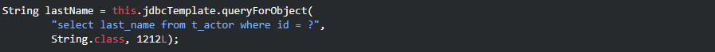
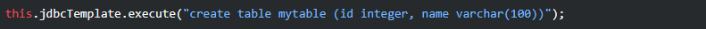
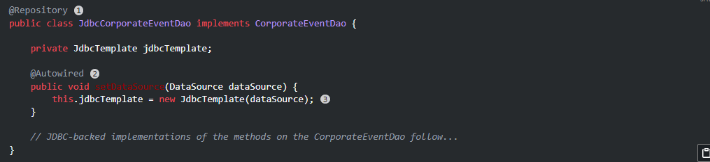
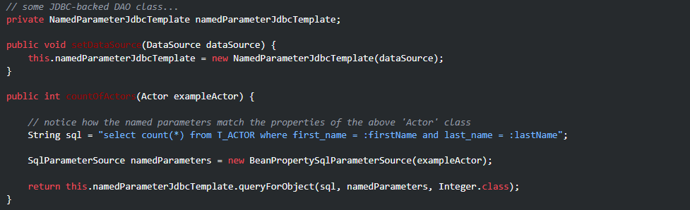
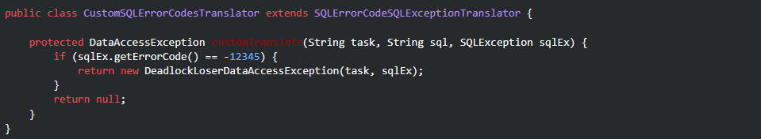
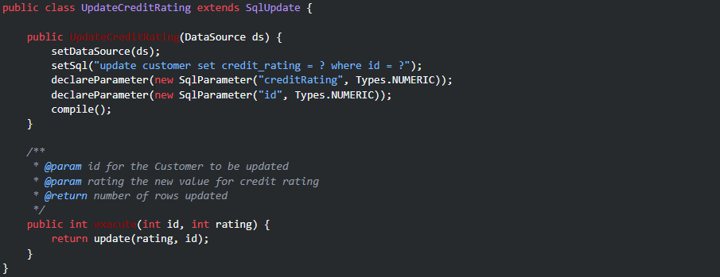
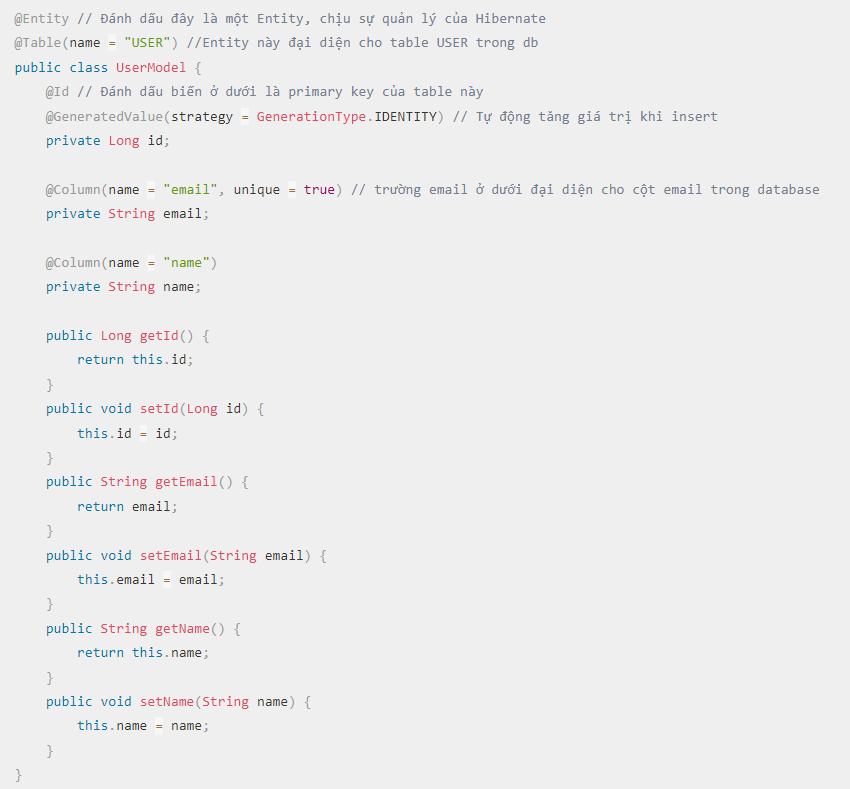

```
JDBC
```
- Bảng thể hiện những hành động sppring jdbc đảm nhiệm  

    |Action| Spring|
    |---|---| 
    |Xác định các tham số kết nối.||
    |Mở kết nối.|x|
    |Chỉ định câu lệnh SQL.| |
    |Khai báo tham số và cung cấp giá trị tham số| |
    |Chuẩn bị và chạy câu lệnh.| x |
    |Thiết lập vòng lặp để lặp qua các kết quả (nếu có).| x |
    |Thực hiện công việc cho mỗi lần lặp lại.| |
    |Xử lý bất kỳ ngoại lệ nào.| x|
    |Xử lý giao dịch.|x|
    |Đóng kết nối, câu lệnh và tập kết quả.|x|  

- Các cách tiếp cận: 
    - JdbcTemplate : cách tiếp cận Spring JDBC cổ điển và phổ biến nhất. Cách tiếp cận “cấp thấp nhất” này và tất cả những cách tiếp cận khác sử dụng một JdbcTemplate dưới vỏ bọc.  
    - NamedParameterJdbcTemplate : bọc 1 JdbcTemplate để cung cấp các tham số được đặt tên thay vì sử dụng ? - các trình giữ chỗ JDBC truyền thống. Cách tiếp cận này cung cấp tài liệu tốt hơn và dễ sử dụng khi bạn có nhiều tham số cho một câu lệnh SQL.  
    - SimpleJdbcInsert và SimpleJdbcCall : tối ưu hóa siêu dữ liệu cơ sở dữ liệu để giới hạn số lượng cấu hình cần thiết. Cách tiếp cận này đơn giản hóa mã hóa để bạn chỉ cần cung cấp tên của bảng hoặc thủ tục và cung cấp bản đồ các tham số khớp với tên cột. Điều này chỉ hoạt động nếu cơ sở dữ liệu cung cấp siêu dữ liệu đầy đủ. Nếu cơ sở dữ liệu không cung cấp siêu dữ liệu này, bạn phải cung cấp cấu hình rõ ràng của các tham số.  
    - Các đối tượng RDBMS — bao gồm MappingSqlQuery, SqlUpdatevà StoredProcedure : yêu cầu tạo các đối tượng có thể tái sử dụng và an toàn cho luồng trong quá trình khởi tạo lớp truy cập dữ liệu. Cách tiếp cận này được lập mô hình sau Truy vấn JDO, trong đó xác định chuỗi truy vấn, khai báo tham số và biên dịch truy vấn. Khi thực hiện điều đó, các phương thức execute(…​), update(…​), và findObject(…​)có thể được gọi nhiều lần với các giá trị tham số khác nhau.  

- Về hệ thống phân cấp gói - Package Hierarchy bao gồm bốn gói khác nhau:  
    - core :  
        org.springframework.jdbc.core package chứa JdbcTemplate class và các giao diện gọi lại khác nhau của nó, cộng với nhiều lớp liên quan.   
        Một gói con có tên org.springframework.jdbc.core.simple chứa các lớp SimpleJdbcInsert và SimpleJdbcCall.  
        Một gói con khác có tên org.springframework.jdbc.core.namedparam chứa NamedParameterJdbcTemplate class và các lớp hỗ trợ liên quan.  
    - datasource:  
        org.springframework.jdbc.datasource package chứa một lớp tiện ích để DataSource truy cập dễ dàng và đa dạng triển khai đơn giản khác nhau có thể sử dụng để kiểm tra và chạy mã JDBC chưa sửa đổi bên ngoài bộ chứa Jakarta EE.  
        Gói con có tên org.springfamework.jdbc.datasource.embeddedcung hỗ trợ để tạo cơ sở dữ liệu nhúng bằng cách sử dụng các công cụ cơ sở dữ liệu Java, chẳng hạn như HSQL, H2 và Derby.  
    - object:  
        org.springframework.jdbc.object chứa các lớp đại diện cho các truy vấn, cập nhật và thủ tục được lưu trữ của RDBMS dưới dạng các đối tượng có thể tái sử dụng, an toàn cho luồng. Cách tiếp cận này được mô hình hóa bởi JDO, mặc dù các đối tượng được trả về bởi các truy vấn được ngắt kết nối với cơ sở dữ liệu một cách tự nhiên. Mức độ trừu tượng JDBC cao hơn này phụ thuộc vào mức độ trừu tượng thấp hơn trong org.springframework.jdbc.core.  
    - support:  
        org.springframework.jdbc.support cung cấp SQLException chức năng biên dịch và một số lớp tiện ích. Các ngoại lệ được ném ra trong quá trình xử lý JDBC được dịch sang các ngoại lệ được xác định trong org.springframework.dao. Điều này có nghĩa là mã sử dụng lớp trừu tượng Spring JDBC không cần triển khai xử lý lỗi dành riêng cho JDBC hoặc RDBMS. Tất cả các ngoại lệ đã dịch đều không được chọn, điều này cung cấp cho bạn tùy chọn bắt các ngoại lệ mà từ đó bạn có thể khôi phục trong khi cho phép các ngoại lệ khác được truyền tới người gọi.  

- Sử dụng JdbcTemplate:  
    JdbcTemplate là lớp trung tâm trong JDBC core package. Nó xử lý việc tạo và giải phóng tài nguyên, giúp tránh được các lỗi phổ biến, chẳng hạn như quên đóng kết nối. Nó thực hiện các tác vụ cơ bản của dòng công việc JDBC cốt lõi (chẳng hạn như tạo và thực thi câu lệnh), cung cấp SQL và trích xuất kết quả.  

    -Chạy truy vấn SQL  
    -Cập nhật các câu lệnh và các cuộc gọi thủ tục được lưu trữ  
    -Thực hiện lặp qua ResultSet các phiên bản và trích xuất các giá trị tham số được trả về.  
    -Bắt các ngoại lệ JDBC và dịch chúng sang hệ thống phân cấp ngoại lệ chung, nhiều thông tin hơn, được xác định trong org.springframework.dao.   

    Sử dụng JdbcTemplate chỉ cần triển khai các giao diện gọi lại, cung cấp cho chúng một hợp đồng được xác định rõ ràng. Connection được cung cấp bởi JdbcTemplate class, PreparedStatementCreator interface gọi lại tạo một câu lệnh đã chuẩn bị sẵn, cung cấp SQL và bất kỳ tham số cần thiết nào. CallableStatementCreator interface cũng tương tự, tạo ra các câu lệnh có thể gọi được. RowCallbackHandler interface trích xuất các giá trị từ mỗi hàng của tệp ResultSet.  
    Sử dụng JdbcTemplatetrong triển khai DAO khởi tạo trực tiếp bằng tham chiếu DataSource hoặc định cấu hình nó trong bộ chứa Spring IoC và cung cấp cho DAO dưới dạng tham chiếu bean. 
     
- Truy vấn trong JDBC:  
    - Select  
    Cơ bản    
       
    Truy vấn với biến trả về int  
      
    Truy vấn với biến trả về String
      
    Truy vấn với biến trả về Object  
      
    Truy vấn với biến trả về list Object  
      
    or để tái sử dụng code  
      
    - Update (sử dụng để thực hiện các thao tác)  
    Insert  
      
    Update  
      
    Delete  
      
    - execute (chạy bất kỳ SQL tùy ý nào - thường dùng cho DDL)  
      
- Thực thi  
    - JDBC Template  
      
    - NamedParameterJdbcTemplate  
    Truyền tham số qua map    
      
    or truyền tham số qua class    
      
    - SQLExceptionTranslator    
      
      
    - Chạy truy vấn  
      
      
    - Truy vấn với khóa tự động  
      
    - DataSource  
      
    - JDBC Batch Operations - hoạt động hàng loạt  
      
      
      
      
    - SimpleJdbc - Đơn giản hóa hoạt động JDBC   
    Các khóa được sử dụng phải Mapkhớp với tên cột của bảng  
      
    Thay vì chuyển vào id, truy xuất khóa được tạo tự động và đặt nó trên Actor, executeAndReturnKeyphương thức. Điều này trả về một java.lang.Number  
      
    Giới hạn cột cho thực thi  
       
    Sử dụng SqlParameterSource để cung cấp các giá trị tham số,Nó sử dụng phương thức getter tương ứng để trích xuất các giá trị tham số. 
      
    Sử dụng SqlParameterSource tương tự hashmap  
      
    - SimpleJdbcCall  
    Lấy các tham số IN và trả về một tham số Map chứa bất kỳ out tham số nào được khóa bởi tên, như được chỉ định trong thủ tục được lưu trữ. Trong trường hợp này, chúng là out_first_name, out_last_name, và out_birth_date.  
      
      
    Khai báo rõ ràng các tham số  
      
- Mô hình hóa hoạt động JDBC như các đối tượng Java  
    org.springframework.jdbc.object chứa các lớp cho phép truy cập cơ sở dữ liệu theo cách hướng đối tượng hơn  
    - SqlQuery  
    Là một lớp thread-safe, có thể tái sử dụng, đóng gói một truy vấn SQL. Các lớp con pnewRowMapper(..) cung cấp RowMapper từ việc lặp lại ResultSet được tạo trong quá trình thực hiện truy vấn.  
    SqlQuery hiếm khi được sử dụng trực tiếp, bởi vì MappingSqlQuery lớp con cung cấp cách triển khai thuận tiện hơn nhiều để ánh xạ các hàng tới các lớp Java. Các triển khai khác mở rộng SqlQuery là MappingSqlQueryWithParameters và UpdatableSqlQuery.  
    - MappingSqlQuery  
    Là một truy vấn có thể sử dụng lại trong đó các lớp con cụ thể phải triển khai mapRow(..)phương thức trừu tượng để chuyển đổi từng hàng của đối tượng được cung cấp bởi ResultSet thành một đối tượng thuộc loại được chỉ định.  
      
      
      
    - SqlUpdate  
      
    - StoredProcedure  
    Là một abstract superclass cho các trừu tượng hóa đối tượng của các thủ tục được lưu trữ trong RDBMS  
      
- Các vấn đề thường gặp với việc xử lý thông số và giá trị dữ liệu  
    - Cung cấp SQL type cho các tham số  
    Nhiều phương thức cập nhật và truy vấn lấy JdbcTemplate parameter bổ sung từ mảng int . Mảng này được sử dụng để chỉ ra SQL type của tham số tương ứng bằng cách sử dụng các giá trị không đổi từ java.sql.Type. Cung cấp một mục cho mỗi tham số.  
    Có thể sử dụng SqlParameterValue để bọc giá trị tham số cần thông tin bổ sung 
    Đối với các phương thức hoạt động với các tham số được đặt tên, có thể sử dụng các SqlParameterSource BeanPropertySqlParameterSource hoặc MapSqlParameterSource. Cả hai đều có các phương thức đăng ký kiểu SQL cho bất kỳ giá trị tham số nào được đặt tên.
    - Xử lý các đối tượng BLOB và CLOB  
    Có thể lưu trữ hình ảnh, dữ liệu nhị phân và khối văn bản lớn trong cơ sở dữ liệu. Những đối tượng lớn này được gọi là BLOB (Đối tượng lớn nhị phân) cho dữ liệu nhị phân và CLOB (Đối tượng lớn ký tự) cho dữ liệu ký tự. Trong Spring, có thể xử lý các đối tượng lớn này bằng cách sử dụng JdbcTemplate trực tiếp và cả khi sử dụng các trừu tượng cao hơn do Đối tượng RDBMS và các SimpleJdbc cung cấp. Tất cả các phương pháp này đều sử dụng triển khai LobHandler interface để quản lý . LobHandlercung cấp quyền truy cập vào một LobCreator class, thông qua getLobCreator method, được sử dụng để tạo các đối tượng LOB mới được chèn vào.  
      
      
    - Chuyển vào danh sách các giá trị cho mệnh đề IN  
    Hãy cẩn thận khi chuyển vào nhiều giá trị. Tiêu chuẩn JDBC không đảm bảo rằng có thể sử dụng hơn 100 giá trị cho một in danh sách biểu thức. Nhiều cơ sở dữ liệu vượt quá con số này, nhưng chúng thường có giới hạn cố định về số lượng giá trị được phép. Ví dụ: giới hạn của Oracle là 1000.  
    - Xử lý các loại phức tạp cho các cuộc gọi thủ tục được lưu trữ  
    Sử dụng SqlTypeValue  
- Hỗ trợ cơ sở dữ liệu nhúng  
    org.springframework.jdbc.datasource.embedded cung cấp hỗ trợ cho các công cụ cơ sở dữ liệu Java nhúng. Hỗ trợ cho HSQL, H2 và Derby được cung cấp nguyên bản. Cũng có thể sử dụng API có thể mở rộng để bổ sung các loại cơ sở dữ liệu được nhúng mới và triển khai DataSource.  
    Cơ sở dữ liệu nhúng có thể hữu ích trong giai đoạn phát triển của dự án vì tính chất nhẹ của nó. Các lợi ích bao gồm dễ cấu hình, thời gian khởi động nhanh, khả năng kiểm tra và khả năng phát triển nhanh SQL của bạn trong quá trình phát triển.  
    Create  
      
- Khỏi tạo datasource  
    org.springframework.jdbc.datasource.init cung cấp hỗ trợ để khởi tạo một DataSource. 
```
Object Relational Mapping - ORM 
```
Spring Framework hỗ trợ tích hợp với Java Persistence API (JPA) và hỗ trợ Hibernate để quản lý tài nguyên, triển khai đối tượng truy cập(DAO) và chiến lược giao dịch. 
Spring bổ sung các cải tiến đáng kể cho lớp ORM khi tạo các ứng dụng truy cập dữ liệu.  
Spring với nhiều hỗ trợ tích hợp.  
Có thể sử dụng nhiều hỗ trợ ORM giống như sử dụng thư viện, bởi vì mọi thứ được thiết kế như một tập hợp các JavaBean có thể tái sử dụng.  
ORM trong bộ chứa Spring IoC tạo điều kiện thuận lợi cho việc cấu hình và triển khai.  
Lợi ích ORM:  
-Dễ kiểm tra. Cách tiếp cận IoC của Spring giúp dễ dàng hoán đổi vị trí triển khai và cấu hình của SessionFactory, Hibernate, DataSource phiên bản JDBC, trình quản lý giao dịch và triển khai đối tượng được ánh xạ (nếu cần). Điều này giúp việc kiểm tra riêng lẻ từng đoạn mã liên quan đến tính bền bỉ trở nên dễ dàng hơn nhiều.  
-Ngoại lệ truy cập dữ liệu. Spring có thể gói các ngoại lệ từ công cụ ORM, chuyển đổi chúng từ các ngoại lệ độc quyền (có khả năng được kiểm tra) thành một DataAccessException. Tính năng này cho phép xử lý hầu hết các trường hợp ngoại lệ liên tục, không thể phục hồi chỉ trong các lớp thích hợp, mà không gây phiền nhiễu cho các thao tác bắt, ném và khai báo ngoại lệ soạn sẵn. Ngoài ra vẫn có thể bẫy và xử lý các ngoại lệ khi cần thiết. Hãy nhớ rằng các ngoại lệ JDBC  cũng được chuyển đổi sang cùng một hệ thống phân cấp, nghĩa là bạn có thể thực hiện một số thao tác với JDBC trong một mô hình lập trình nhất quán.  
-Quản lý tài nguyên chung. Spring contex có thể quản lý vị trí và cấu hình của SessionFactory - Hibernate, EntityManagerFactory - JPA, DataSource - JDBC và các tài nguyên liên quan khác. Spring cung cấp khả năng xử lý hiệu quả, dễ dàng và an toàn các tài nguyên bền bỉ. 
-Quản lý giao dịch tích hợp. Có thể bọc mã ORM bằng lập trình hướng khía cạnh (AOP) thông qua chú thích @Transactional hoặc bằng tệp cấu hình XML. Trong cả hai trường hợp, ngữ nghĩa giao dịch và xử lý ngoại lệ (rollback, v.v.) đều được xử lý. Có thể hoán đổi các trình quản lý giao dịch khác nhau mà không ảnh hưởng đến mã liên quan đến ORM .  

Spring hỗ trợ các giải pháp đơn giản để xử lý tài nguyên, cụ thể là IoC thông qua tạo khuôn mẫu trong  JDBC và áp dụng các bộ chặn AOP cho các công nghệ ORM.  
Xử lý ngoại lệ:  
DAO đưa ra một lớp con của a HibernateException hoặc PersistenceException, tùy thuộc vào công nghệ. Các ngoại lệ này đều là ngoại lệ thời gian chạy và không cần phải khai báo hoặc bắt. Bạn cũng có thể phải giải quyết IllegalArgumentException và IllegalStateException. Spring cho phép giao dịch ngoại lệ được áp dụng một cách minh bạch thông qua @Repository annotation.  
  
```
Hibernate
```  
Hibernate là framework được sử dụng nhiều nhất hiện nay để giúp lập trình viên Java có thể map các class (Pojo) với một cơ sở dữ liệu bất kỳ.  
Hibernate là một thư viện ORM (Object Relational Mapping) mã nguồn mở giúp lập trình viên viết ứng dụng Java có thể map các objects (pojo) với hệ quản trị cơ sở dữ liệu quan hệ, và hỗ trợ thực hiện các khái niệm lập trình hướng đối tượng với cớ dữ liệu quan hệ.  
Hiểu ngắn gọn thì Hibernate sẽ là một layer đứng trung gian giữa ứng dụng và database, và chúng ta sẽ giao tiếp với Hibernate thay vì giao tiếp với database  
Để giao tiếp với Hibernate, chúng ta sẽ tạo ra một Class đại diện cho một Table. Và mọi dữ liệu từ Table trong database sẽ được Hibernate bind vào Class đó cho chúng ta.  
POJO:  
    Là class đại diện cho 1 table 
    All properties must public setter and getter methods (mọi biến đều phải có get/set)  
    All instance variables should be private (mọi biến là thuộc tính thì nên là private)  
Khi đã có Class đại diện cho Table, định nghĩa các trường trong class đó tương ứng với column nào trong database bằng tập hợp các Annotaion mà Hibernate cung cấp.  
  
Hibernate sử dụng ngôn ngữ Hibernate Query Language (HQL) để query dữ liệu. Nó chỉ khác SQL bình thường ở chỗ, đối tượng tác động lúc này là Entity chứ không phải là Table.
- Session
    Đối tượng chính của việc truy xuất hay insert dữ liệu bằng Hibernate chính là Session và được tạo ra từ Session Factory.   
    Session Factory Là một interface giúp tạo ra session kết nối đến database bằng cách đọc các cấu hình trong một file xml và mỗi loại Database khác nhau sẽ có một cấu hình khác nhau.  
    Vd  
    File cấu hình hibernate.cfg.xml  
      
    Tạo session Factory  
      
    Thực hiện query   
      
    Thiết lập SessionFactory trong Spring Container:  
        Để tránh buộc các đối tượng ứng dụng vào tra cứu hard-coded resource, => xác định các tài nguyên (chẳng hạn như Resource JDBC hoặc Hibernate SessionFactory) dưới dạng các bean trong bộ chứa Spring  
Thực thi đơn giản:  
      
@Transactional:  
    annotation hỗ trợ cho phép thay thế lệnh gọi API phân định giao dịch rõ ràng trong mã Java bằng trình chặn giao dịch AOP. Cho phép tập trung vào logic nghiệp vụ, lược bỏ code thừa.  
      
Programmatic Transaction Demarcation:  
    SpringInterceptor cho phép ném bất kỳ ngoại lệ ứng dụng đã kiểm tra nào với callback. TransactionTemplate bị hạn chế đối với các ngoại lệ không được kiểm tra trong callback  
      
    Cả TransactionTemplate và TransactionInterceptor đều ủy quyền xử lý giao dịch thực tế cho một phiên bản PlatformTransactionManager  

``` 
JPA
```  
JPA là một đặc tả chỉ định cách truy cập, quản lý và duy trì thông tin/dữ liệu giữa các đối tượng java và cơ sở dữ liệu quan hệ. Nó cung cấp một cách tiếp cận tiêu chuẩn cho ORM, Ánh xạ quan hệ đối tượng. Spring Boot cung cấp sự tích hợp dường như vô tận với JPA.  
Spring Boot JPA là một phần trong hệ sinh thái Spring Data, nó tạo ra một layer ở giữa tầng service và database, giúp chúng ta thao tác với database một cách dễ dàng hơn, tự động config và giảm thiểu code thừa thãi.  
Spring Boot JPA đã wrapper Hibernate và tạo ra một interface mạnh mẽ.  
JpaRepository:  
Để sử dụng Spring JPA, cần sử dụng interface JpaRepository.  
Yêu cầu của interface này đó là bạn phải cung cấp 2 thông tin:   
    Entity (Đối tượng tương ứng với Table trong DB)  
    Kiểu dữ liệu của khóa chính (primary key)  
      
Thực thi  
  
- Các anotation:  
    - @Repository  
        Đặt trước interface or class  
        đánh dấu là một Bean và chịu trách nhiệm giao tiếp với DB.  
          
    - @Entity  
        Đánh dấu đây là một Entity, chịu sự quản lý của Hibernate  
    - @Table(name = "user")  
        Entity này đại diện cho table USER trong db  
    - @Id  
        Đánh dấu biến ở dưới là primary key của table này  
    - @GeneratedValue(strategy = GenerationType.IDENTITY)  
        Tự động tăng giá trị khi insert  
    - @Column(name = "hp")  
        Mapping thông tin biến với tên cột hp trong Database  
    - @OneToOne  
        Đánh dấu có mỗi quan hệ 1-1 với Entity khác  
    - @JoinColumn(name = "person_id")  
        Liên kết với nhau qua khóa ngoại person_id  
    - @OneToMany(mappedBy = "address", cascade = CascadeType.ALL)  
        Quan hệ 1-n với đối tượng ở dưới (1-n)  
        MappedBy trỏ tới tên biến Address ở trong Entity kia.  
    - @EqualsAndHashCode.Exclude  
        không sử dụng trường này trong equals và hashcode  
    - @ToString.Exclude  
        Không sử dụng trong toString()  
    - @ManyToOne  
        Quan hệ n-1 với đối tượng ở dưới  
    - @RequiredArgsConstructor  
        auto tạo Constructor  
        kết hợp với final để thay cho @Autowired  
    - @ManyToMany(cascade = CascadeType.ALL, fetch = FetchType.LAZY)  
        Quan hệ n-n với đối tượng ở dưới  
    - @ManyToMany(mappedBy = "persons")  
        trỏ tới tên biến persons ở trong Address  
    - @JoinTable(name = "address_person", joinColumns = @JoinColumn(name = "address_id"),  inverseJoinColumns = @JoinColumn(name = "person_id") )  
        Tạo ra một join Table tên là "address_person"  
        Trong đó, khóa ngoại chính là address_id trỏ tới class hiện tại   
        Khóa ngoại thứ 2 trỏ tới Entity ở dưới  
    - CascadeType.ALL 
        Lưu cả Entity tham chiếu với Entity hiện tại  
    - @Transactional   
        Đưa toàn bộ code chạy trong hàm đều nằm trong Session quản lý của Hibernate.  
    - @Query(value = "select * from User u where u.email_address = ?1", nativeQuery = true)  
        Khi được gắn @Query, thì tên của method không còn tác dụng nữa  
        Truyền tham theo thứ tự các tham số của query ?1, ?2  
        Thay vì sử dụng ? ta có thể dùng:  
        @Query("SELECT u FROM User u WHERE u.status = :status and u.name = :name")  
        User findUserByNamedParams(@Param("status") Integer status, @Param("name") String name);  

- Quy tắc đặt tên method trong Spring JPA:  
    Cơ chế xây dựng truy vấn thông qua tên của method được quy định bởi các tiền tố sau:  
    find…By,  
    read…By,  
    query…By,  
    count…By,  
    get…By.  
    Phần còn lại sẽ được parse theo tên của thuộc tính (viết hoa chữ cái đầu). Nếu chúng ta có nhiều điều kiện, thì các thuộc tính có thể kết hợp với nhau bằng chữ And hoặc Or.  
    vd:  
    Tìm kiếm theo EmailAddress và Lastname  
        findByEmailAddressAndLastname(EmailAddress emailAddress, String lastname);  
    Distinct: Tìm kiếm và loại bỏ đi các đối tượng trùng nhau  
        findDistinctPeopleByLastnameOrFirstname(String lastname, String firstname);   
    IgnoreCase: Tìm kiếm không phân biệt hoa thường  
        findByLastnameIgnoreCase(String lastname);  
    AllIgnoreCase: Tìm kiếm không phân biệt hoa thường cho tất cả thuộc tính  
        findByLastnameAndFirstnameAllIgnoreCase(String lastname, String firstname);  
    Order : Sắp xếp theo Firstname ASC  
        findByLastnameOrderByFirstnameAsc(String lastname);  
    Tìm kiếm đối tượng People có thuộc tính là đối tượng Address và trong address có zipCode  
        findByAddressZipCode(ZipCode zipCode);   
      
- Truy cập JPA Data với REST  
    1. Thêm các dependency cho JPA : Web, JPA.H2, DevTools
    2. create entity  
    
    3. create repository  
      
    4. setup  
    @RestController : Sự kết hợp của @Controller và @ResponseBody. Bean trả về được chuyển đổi sang và từ JSON hoặc XML.  
    @Autowired : tự động tiêm phụ thuộc  
      
    Tạo method  
      
      
      
- Truy cập JPA với MySQL  
    1. Thêm các dependency cho JPA : Spring Web, Spring Data JPA, and MySQL Driver.  
    2. Create database trong MySQL  
    3. Cấu hình truy cập database trong application.properties  
     
    4. Create entity  
      
    5. Create repository  
      
    6. Create controller  
    
    7. Create application class  
      
- Truy cập JPA với MongoDB  
    1. Thêm các dependency cho JPA : Spring Data MongoDB.  
    2. Cấu hình truy cập database trong application.properties  
      
      
    3. Create entity  
     
    4. create repository  
    
    5. Create application class    
    
