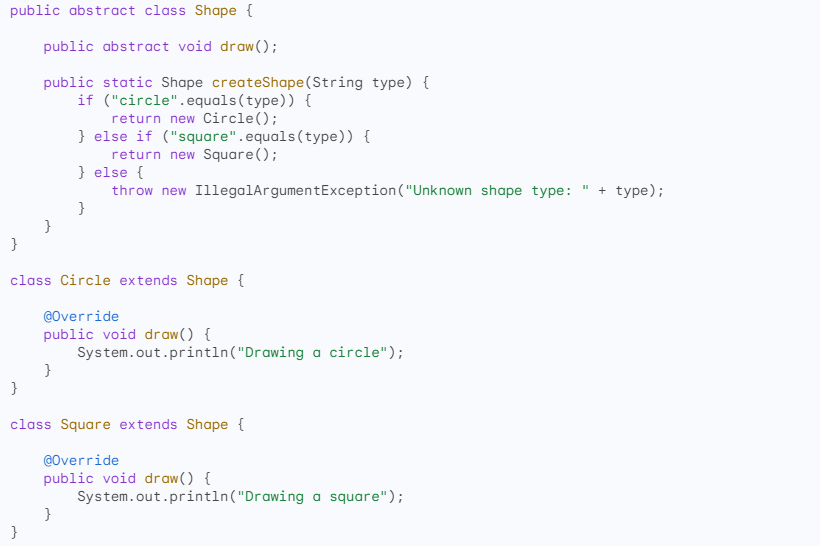
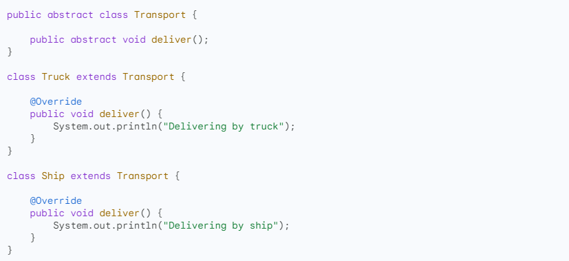
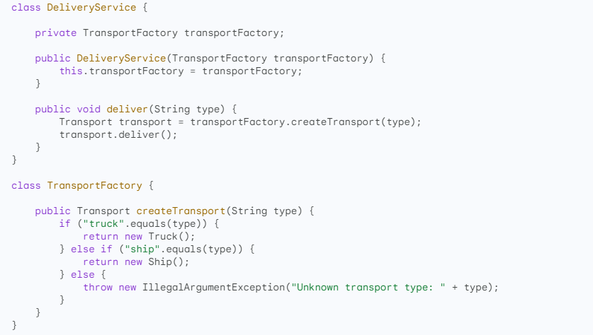
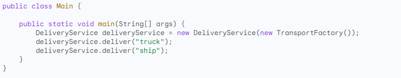
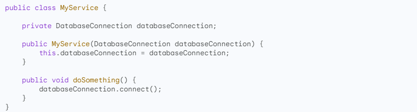
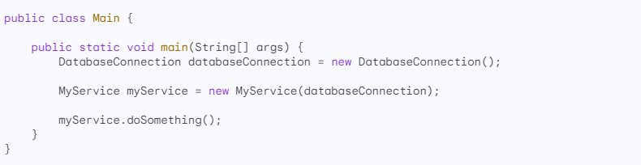
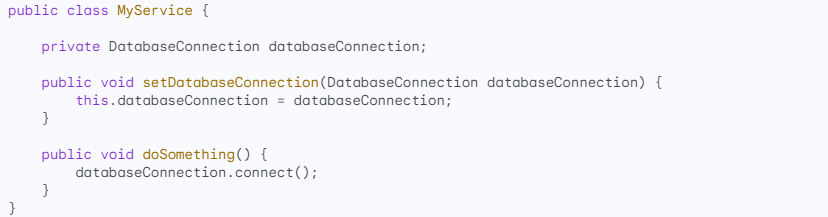
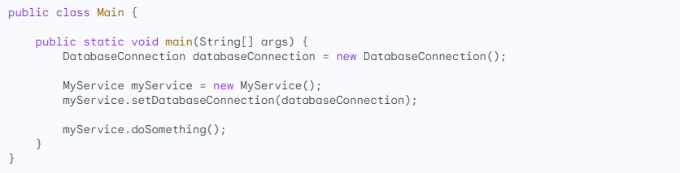

```
IOC (Inversion of Control)
```
- Là một nguyên lý thiết kế ứng dụng, trong đó thay vì các đối tượng tự tạo ra các đối tượng mà chúng cần, thì một bên thứ ba sẽ tạo ra và cung cấp các đối tượng đó cho chúng.
- Trong Spring, bên thứ ba đó là Spring Container (IoC Container). Spring Container sẽ quản lý vòng đời của các bean các đối tượng trong dự án Spring, khởi tạo, cấu hình, và tương tác giữa các bean trong ứng dụng Spring.
- Ví dụ, thay vì một đối tượng CustomerService tự tạo ra một đối tượng DatabaseService, thì Spring Container sẽ tạo ra cả hai đối tượng này và cung cấp DatabaseService cho CustomerService.
- Lợi ích:
	- Tăng tính linh hoạt, khả năng mở rộng của ứng dụng:  các đối tượng không tự tạo ra các đối tượng mà chúng cần =>có thể dễ dàng được 
	- Thay thế bằng các đối tượng khác mà không cần thay đổi mã nguồn của chúng.
	- Giảm sự phụ thuộc giữa các đối tượng:  Khi các đối tượng không tự tạo ra các đối tượng mà chúng cần => chúng sẽ ít phụ thuộc lẫn nhau hơn => giảm sự phức tạp của ứng dụng và cải thiện khả năng bảo trì của ứng dụng.
	- Tăng tính dễ test của ứng dụng: Các đối tượng có thể được test độc lập với nhau=>việc kiểm tra chất lượng ứng dụng dễ dàng hơn.
	- Tăng tính bảo trì của ứng dụng: Việc quản lý vòng đời của các đối tượng được thực hiện bởi Spring Container => bảo trì ứng dụng dễ dàng hơn.
	- Tăng tính đơn giản và dễ hiểu của mã nguồn: Khi các đối tượng không tự tạo ra các đối tượng mà chúng cần, thì mã nguồn sẽ đơn giản và dễ hiểu hơn => giúp giảm thời gian và chi phí phát triển ứng dụng.
- Trong Spring, IOC được triển khai thông qua hai kỹ thuật chính:
	- Dependency Injection (DI): Kỹ thuật này cho phép một đối tượng (client) nhận một đối tượng khác (dependency) từ một bên thứ ba (container).
	- Service Locator: Kỹ thuật này cho phép một đối tượng (client) tìm kiếm một đối tượng (dependency) từ một bên thứ ba (locator).
	- Events: Đây là một cách triển khai IOC dựa trên sự kiện. Khi một sự kiện xảy ra, các đối tượng quan tâm sẽ được thông báo.
- Dependency Injection là kỹ thuật phổ biến nhất để triển khai IOC trong Spring.

```
Factory Method
```
- Là một mẫu thiết kế tạo lập trong lập trình hướng đối tượng. Mẫu thiết kế này cung cấp một phương thức (method) chung để tạo các đối tượng của một lớp cụ thể hoặc các lớp con của lớp đó.
- Mục đích là để tách biệt việc tạo đối tượng khỏi việc sử dụng đối tượng => tạo đối tượng trở nên linh hoạt và dễ dàng thay đổi hơn
- Cấu trúc :
	- Lớp cơ sở (base class): Lớp cơ sở này cung cấp một phương thức factory method để tạo đối tượng.
	- Lớp con (derived class): Lớp con này có thể ghi đè phương thức factory method của lớp cơ sở để tạo ra các đối tượng con của mình.
- VD
    
```
DI(Dependency Injection)
```
- Đây là một kỹ thuật lập trình trong đó một đối tượng (client) nhận một đối tượng khác (dependency) từ bên thứ ba (container).
- Cách xác định các phụ thuộc:
	- Constructor Arguments: Đối tượng có thể xác định các phụ thuộc của mình thông qua các đối số của constructor (hàm tạo).
	- Factory Method Arguments: Có thể thông qua các đối số của một phương thức tạo đối tượng (factory method).
	- Properties Set After Construction: thông qua các thuộc tính (properties) được thiết lập sau khi đối tượng được khởi tạo hoặc được trả về từ một phương thức tạo.
- Cách triển khai:
	- Constructor injection: cách triển khai DI đơn giản nhất.Đối tượng có thể xác định các phụ thuộc của mình thông qua các đối số của constructor (hàm tạo).
        - Ưu điểm: lỗi sẽ được báo ngay khi khởi tạo Bean;  phù hợp hơn cho các phụ thuộc bắt buộc (immutable); 
	- Setter injection: cách triển khai DI phức tạp hơn một chút. Trong setter injection, các dependency được inject vào các setter của đối tượng.
        - Ưu điểm:  thích hợp cho các dependencies tùy chọn; 
	- Field injection: Đây là cách triển khai DI ít được sử dụng nhất. Trong field injection, các dependency được inject trực tiếp vào các field của đối tượng.
- DI dựa trên contructor có thể gây ra Circular dependencie => để giải quyết có thể dùng DI dựa trên setter
- VD
    - DI với Factory Method
    
    
    
    -  DI với constructor injection: 
    
    
    Trong ví dụ này, lớp MyService cần một đối tượng DatabaseConnection để hoạt động. Thay vì tự tạo ra đối tượng DatabaseConnection, lớp MyService sử dụng DI với constructor injection để nhận đối tượng DatabaseConnection từ bên ngoài.
    - DI với Setter injection
    
    
```
AOP (Aspect-Oriented Programming - lập trình hướng khía cạnh)
```
- Đây là một kỹ thuật lập trình cho phép tách biệt các mối quan tâm xuyên suốt (cross-cutting concerns như logging, security, caching, tracing, ... là những mối quan tâm xuyên suốt phổ biến) khỏi mã ứng dụng.
- Lợi ích:
    - Làm cho mã ứng dụng trở nên linh hoạt và dễ bảo trì: AOP giúp chúng ta tách biệt các mối quan tâm xuyên suốt khỏi mã ứng dụng. Điều này giúp cho mã ứng dụng trở nên linh hoạt và dễ bảo trì hơn.
    - Tăng tính tái sử dụng: AOP giúp chúng ta tái sử dụng các mối quan tâm xuyên suốt. Điều này giúp tiết kiệm thời gian và công sức phát triển ứng dụng.
    - Tăng tính mở rộng: AOP giúp chúng ta dễ dàng thêm hoặc thay đổi các mối quan tâm xuyên suốt. Điều này giúp ứng dụng dễ dàng thích ứng với các yêu cầu thay đổi.
- Cách triển khai:
    - AOP dựa trên proxy: Trong AOP dựa trên proxy, các aspect được triển khai dưới dạng các proxy. Các proxy sẽ đóng vai trò là đại diện cho các đối tượng thực. Khi chúng ta gọi một phương thức của một đối tượng, proxy sẽ thực hiện các mối quan tâm xuyên suốt trước khi thực hiện phương thức của đối tượng thực.
    - AOP dựa trên annotation: Trong AOP dựa trên annotation, các aspect được triển khai dưới dạng các annotation. Các annotation được sử dụng để đánh dấu các phương thức hoặc các lớp cần được áp dụng các mối quan tâm xuyên suốt.
```
Configuration metadata - Siêu dữ liệu cấu hình
```
- Viết băng XML, Java annotation, Java code
- Cho phép thể hiện object và sự phụ thuộc giữa các object đó
```
Bean
```
- Là các object được quản lý bởi Spring IoC container (được coi là xương sống của ứng dụng)
- Được tạo bởi Configuration metadata
- Định nghĩa bean được biểu diễn dưới dạng BeanDefinition objects
- Khởi tạo bean
    - Các bước:
    1. Load BeanDefinition: Spring tìm kiếm các BeanDefinition từ các nguồn khác nhau như classpath, annotation, XML file.
    2. Resolve dependencies: Spring tìm kiếm các Bean phụ thuộc của Bean đang được tạo và tạo instance của chúng trước.
    3. Create Bean instance: Spring sử dụng constructor injection hoặc setter injection để inject các dependencies vào Bean instance mới.
    4. Initialize Bean: Spring thực hiện các phương thức lifecycle callback như init-method để chuẩn bị Bean cho sử dụng.
- Spring xác định cấu hình bean khi container được tạo, tuy nhiên các thuộc tính ko được thiết lập cho đến khi Bean thực sự được tạo. Các singleton-scoped mặc định được đặt ở chế độ khởi tạo trước khi container được tạo. Các bean khác chỉ được tạo khi được yêu cầu. 
- Có thể thay đổi hành vi khởi tạo singleton Bean bằng lazy annotation, nếu không muốn bean được tạo khi container đc tạo

```
BeanDefinition object
``` 
- Là các đối tượng được tạo trong Spring IoC container để chứa thông tin về cách tạo và cấu hình các bean (đối tượng) trong ứng dụng. Đại diện cho các bean bên trong container, cho phép quản lý và truy cập các bean một cách linh hoạt, tách biệt khỏi code logic của ứng dụng.
- Các thông tin quan trọng trong BeanDefinition:
    - Tên class : Giúp Spring xác định chính xác class nào cần tạo instance cho bean.
    - Scope: Nên sử dụng prototype cho Bean có trạng thái, còn Bean không trạng thái => singleton
        - Singleton: Container quản lý 1 instance duy nhất Khi 1 singleton bean  được tạo, 1 instance của nó được đặt trong bộ đệm, và các tham chiếu đến bean đó đều trả về instance trong bộ đệm đó
	    - Prototype: Tạo ra instance mới mỗi khi có yêu cầu đến bean đó
    - Lifecycle callbacks: các phương thức đặc biệt trong vòng đời của bean. Cho phép thực hiện các logic cụ thể trước khi tạo (init-method) và sau khi hủy (destroy-method).
    - Tham chiếu đến các bean khác: BeanDefinition có thể chứa danh sách các tham chiếu đến các bean khác mà bean này cần để hoạt động. Giúp Spring thực hiện dependency injection, tự động inject các bean cần thiết vào bean này.
    - Các cấu hình khác: Cài đặt các thuộc tính cụ thể cho bean, ví dụ: giới hạn kích thước của pool, số kết nối trong pool, ...


