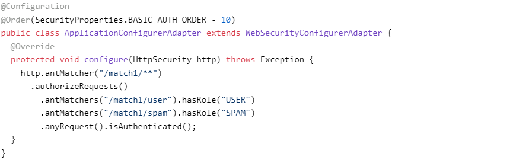

```
Sping Security
```
Bảo mật tập trung vào các vấn đề: authentication - xác thực, authorization - ủy quyền (or Access Control - kiểm soát truy cập) và bảo vệ chống lại các cuộc tấn công phổ biến
+ Về authentication - xác thực   
AuthenticationManager Interface là một thành phần quan trọng trong Spring Security, xác định cách mà bộ lọc Spring thực hiện xác thực, cung cấp cơ chế để xác thực người dùng trước khi họ được phép truy cập vào ứng dụng.   
AuthenticationManager có một method duy nhất là authenticate(), method này sẽ thực hiện xác thực cho một Authentication object. Authentication object là một đối tượng đại diện cho một người dùng, nó chứa các thông tin như username, password, roles,...  
   
Về Method authenticate:  
    - Chịu trách nhiệm xác định xem người dùng có được phép truy cập vào ứng dụng hay không bằng cách kiểm tra thông tin đăng nhập của họ.
    - Trả về object Authentication ( với trường hợp authenticated=true), nếu nó kiểm tra được các giá trị input là hợp lệ.
    - Trả về exception (AuthenticationException) nếu các giá trị input không hợp lệ  
    - Trả về null nếu nó không thể xử lý.  

    Về AuthenticationException:  
    - Là một Runtime Exception, được ném ra bởi Spring Security khi có lỗi xảy ra trong quá trình xác thực (vì là runtime exception => không cần bắt và xử lý)  
    - các lỗi có thể gây ra AuthenticationException bao gồm: Username hoặc password không chính xác, Người dùng không có quyền truy cập vào tài nguyên, Lỗi cơ sở dữ liệu, Lỗi trong quá trình xác thực  
    - Khi AuthenticationException được ném ra, Spring Security sẽ không cho phép người dùng truy cập vào tài nguyên. Người dùng sẽ cần phải giải quyết lỗi và cố gắng xác thực lại.
    - Một cách để xử lý AuthenticationException là sử dụng @ExceptionHandler annotation. @ExceptionHandler annotation cho phép chỉ định một phương thức sẽ được gọi khi một exception cụ thể được ném ra, có thể sử dụng @ExceptionHandler annotation để xử lý AuthenticationException và hiển thị một thông báo lỗi cho người dùng. Phương thức handleAuthenticationException() sẽ được gọi khi một AuthenticationException được ném ra. 
      

    Một số triển khai của AuthenticationManager:  
    - ProviderManager: Là triển khai phổ biến nhất. ProviderManager sẽ sử dụng một danh sách các AuthenticationProvider để xác thực người dùng.  AuthenticationProvider khá giống AuthenticationManager nhưng nó có một phương thức bổ sung để cho phép người gọi truy vấn xem nó có hỗ trợ một loại Authentication nhất định hay không  
      
    Đối số Class<?> trong method supports() thật chỉ là 1 dạng ngắn gọn của cú pháp Class<? extends Authentication>. 1 ProviderManager có thể hỗ trợ nhiều cơ chế xác thực khác nhau trong cùng một ứng dụng bằng cách ủy quyền cho một chuỗi AuthenticationProviders. Nếu ProviderManagerkhông nhận ra một kiểu instance Authentication cụ thể, nó sẽ bị bỏ qua.  
    Một ProviderManager có thể được extend từ một class cha tuỳ chọn, nơi mà nó có thể được xem xét nếu tất cả các provider trả về kiểu null. Nếu class cha này không có sẵn thì ứng dụng sẽ trả về 1 AuthenticationException exception.  
    Một ứng dụng có thể có các tài nguyên được bảo vệ khớp với một mẫu đường dẫn( vd: /api/**) và mỗi nhóm có thể có các tệp AuthenticationManager. Thông thường, mỗi trong số đó là một ProviderManagervà chúng có chung parent. Khi đó, parent là một loại tài nguyên “toàn cầu”, hoạt động như một phương án dự phòng cho tất cả các Provider con.  
    
    - InMemoryAuthenticationManager: là triển khai của AuthenticationManager lưu trữ thông tin người dùng trong bộ nhớ.  
    - JdbcAuthenticationManager: Đây là triển khai của AuthenticationManager lưu trữ thông tin người dùng trong cơ sở dữ liệu.  

    Cách thức hoạt động:  
    Khi một người dùng đăng nhập vào ứng dụng, một yêu cầu sẽ được gửi đến AuthenticationManager. AuthenticationManager sẽ sử dụng thông tin đăng nhập của người dùng để xác thực( nếu dùng ProviderManager: AuthenticationManager sẽ chuyển nó cho ProviderManager. ProviderManager sẽ tìm kiếm một AuthenticationProvider phù hợp để xác thực Authentication object. Nếu tìm thấy một AuthenticationProvider phù hợp, ProviderManager sẽ gọi method authenticat() của AuthenticationProvider để xác thực Authentication object.). Nếu ok => AuthenticationManager trả về một đối tượng Authentication, chứa thông tin về người dùng đã được xác thực, bao gồm username, password, roles, và authorities.  \
    AuthenticationManager đóng vai trò trung gian giữa các yêu cầu xác thực từ ứng dụng và các Provider để kiểm tra thông tin đăng nhập và xác nhận quyền truy cập của người dùng trong ứng dụng. 
    
Lợi ích:  
    - Cung cấp một cách tập trung để xác thực người dùng.
    - Có thể mở rộng => có thể triển khai custom authentication providers.
    - An toàn vì sử dụng nhiều kỹ thuật khác nhau để ngăn chặn truy cập trái phép.  

    Customizing Authentication Managers - tùy chỉnh quản lý xác thực:  
    - Spring Security cung cấp một số trình trợ giúp cấu hình. Trình trợ giúp được sử dụng phổ biến nhất là AuthenticationManagerBuilder, phù hợp cho thiết lập chi tiết trong bộ nhớ, JDBC hoặc LDAP hoặc để thêm instance UserDetailsService.  
    VD build global AuthenticationManager  
      
    VD build local AuthenticationManager  
      
    Nếu sử dụng @Override, thì phương thức AuthenticationManagerBuilder sẽ chỉ được sử dụng để xây dựng một “cục bộ” AuthenticationManager, phương thức này sẽ là con của phương thức global. Trong spring, @Autowire có thể chuyển sang một bean khác, nhưng không thể làm điều đó với local trừ khi phơi bày nó một cách rõ ràng.  
+ Authorization or Access Control - Ủy quyền hoặc Kiểm soát truy cập  
    - AccessDecisionManager  
    Là một interface trong Spring Security, xác định cách mà Spring Security thực hiện ủy quyền, giúp cho việc xác định quyền truy cập vào tài nguyên của user trở nên dễ dàng và hiệu quả hơn.  
    AccessDecisionManager có một method duy nhất là decide(), method này sẽ quyết định xem một người dùng có được phép truy cập vào một tài nguyên hay không.  
      
    Method decide() nhận ba tham số:  
        - Authentication object: Đối tượng đại diện cho người dùng đang cố gắng truy cập vào tài nguyên.
        - Object object: Đối tượng đại diện cho tài nguyên mà người dùng đang cố gắng truy cập.(tài nguyên web hoặc phương thức trong lớp Java là hai trường hợp phổ biến nhất)  
        - Collection<ConfigAttribute> configAttributes: Một collection chứa các config attributes. Config attribute là một đối tượng đại diện cho một yêu cầu bảo mật. Ví dụ, một config attribute có thể là một role name hoặc một URL.  

        Method decide() sẽ gọi các AccessDecisionVoter để xác định xem người dùng có được phép truy cập vào tài nguyên hay không. AccessDecisionVoter là một interface, nó xác định cách mà một config attribute được vote.

        -Cách thức hoạt động:  
        Khi Authentication object và Resource object được gửi đến AccessDecisionManager, AccessDecisionManager sẽ chuyển chúng cho tất cả các AccessDecisionVoter được quản lý  
        AccessDecisionVoter sẽ bỏ phiếu cho việc cho phép hoặc từ chối truy cập.  
        AccessDecisionManager sẽ tổng hợp các phiếu bầu từ tất cả các AccessDecisionVoter và đưa ra quyết định cuối cùng về quyền truy cập. Nếu quyết định là cho phép, Authentication object sẽ được phép truy cập vào Resource object. Nếu quyết định là từ chối, Authentication object sẽ không được phép truy cập vào Resource object. 

        Spring Security cung cấp một số cách để triển khai AccessDecisionManager, cách phổ biến nhất là sử dụng AbstractAccessDecisionManager. AbstractAccessDecisionManager là một lớp abstract, nó cung cấp một số phương thức helper để giúp cho việc triển khai AccessDecisionManager trở nên dễ dàng hơn.   
        Vì là một lớp abstract => nó phải được triển khai bởi các lớp con. Các lớp con của AbstractAccessDecisionManager có thể tùy chỉnh cách thức quyết định truy cập.  
        Một số lớp con phổ biến:  
            - AffirmativeBased: Phương thức decide() của AffirmativeBased sẽ cho phép truy cập nếu ít nhất một AccessDecisionVoter bỏ phiếu cho phép truy cập.  
            - ConsensusBased: Phương thức decide() của ConsensusBased sẽ cho phép truy cập nếu ít nhất một nửa số AccessDecisionVoter bỏ phiếu cho phép truy cập.  
            - UnanimousBased: Phương thức decide() của UnanimousBased sẽ chỉ cho phép truy cập nếu tất cả các AccessDecisionVoter đều bỏ phiếu cho phép truy cập.  
    
- Web Security  
    Spring Security trong tầng web (cho UIs và HTTP back ends) là dựa trên Filters Servlet  
      

    Filters Servlet hoạt động bằng cách lọc các request và response của ứng dụng web. Filters Servlet được gọi trước khi ứng dụng web xử lý request và sau khi ứng dụng web xử lý response.  

    Khi một request được gửi đến ứng dụng web, Filters Servlet sẽ được thực thi theo thứ tự chúng được đăng ký. Mỗi Filter sẽ có cơ hội thực hiện các tác vụ của mình trên request và response. Sau khi tất cả các Filters đã được thực thi, request sẽ được chuyển đến Servlet được yêu cầu.

    Khi một response được trả về từ Servlet, Filters Servlet sẽ được thực thi theo thứ tự ngược lại. Mỗi Filter sẽ có cơ hội thực hiện các tác vụ của mình trên response trước khi nó được trả về cho người dùng.  
    Filters Servlet có thể được sử dụng để thực hiện các tác vụ như:  
        - Xác thực người dùng: sử dụng để xác thực người dùng trước khi họ được phép truy cập vào ứng dụng web.  
        - Phân quyền: sử dụng để cấp quyền cho người dùng truy cập vào các tài nguyên khác nhau trong ứng dụng web.
        - Mã hóa: sử dụng để mã hóa các request và response.  
        - Chống CSRF  
        - Chống XSS  

    Sử dụng Filters Servlet:   
    -Thêm dependency của Spring Security vào pom.xml.  
    -Sau đó, tạo một lớp Filter và triển khai interface Filter.  
    -Trong lớp Filter, override phương thức doFilter() và thực hiện các tác vụ muốn thực hiện trên các request và response.
    -Sau khi tạo lớp Filter, đăng ký nó với Spring Boot bằng cách sử dụng @Bean annotation hoặc bằng cách sử dụng @Configuration class.  
    -Sau khi đăng ký Filter, run app. Khi ứng dụng được khởi động, Filter sẽ bắt đầu lọc các request và response.  
    VD:  
      
      
    Lớp AuthFilter triển khai interface Filter và override phương thức doFilter(). Phương thức doFilter() được sử dụng để xác thực người dùng.  
    Phương thức doFilter() nhận ba tham số:  
    -request: Một đối tượng đại diện cho request HTTP.  
    -response: Một đối tượng đại diện cho response HTTP.  
    -chain: Một đối tượng đại diện cho chuỗi các filter.  
    Phương thức doFilter() thực hiện các bước sau:  
    -Lấy username và password từ request.   
    -Kiểm tra xem người dùng có được xác thực hay không.  
    -Nếu người dùng không được xác thực, thì chuyển hướng người dùng đến trang đăng nhập.  
    -Nếu người dùng được xác thực, thì chuyển tiếp request đến filter tiếp theo trong chuỗi các filter.  

    Spring Security được cài đặt dưới dạng một Filter chain duy nhất - FilterChainProxy  
    Security filter là 1 bean trong ApplicationContext    
    Tất cả các filter bên trong Spring Security đều không xác định đối với container  
      

    Tạo và tùy chỉnh filter chain  
      
    WebSecurityConfigurerAdapter có một trình so khớp yêu cầu được sử dụng để quyết định có áp dụng nó cho một yêu cầu HTTP hay không.  
      
      
      


        

